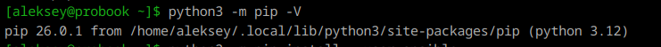
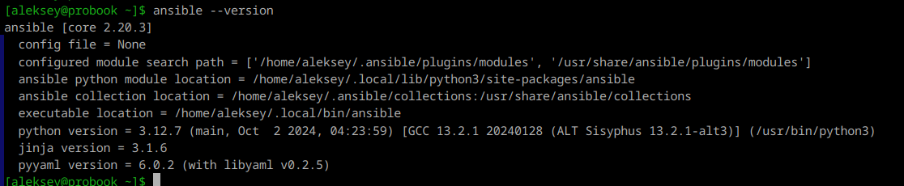
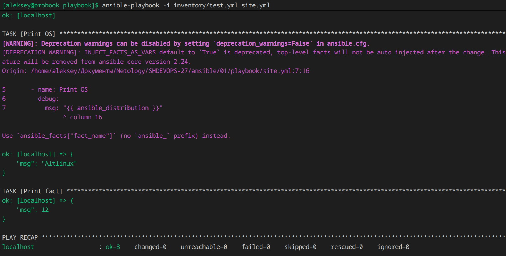
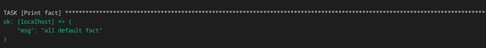
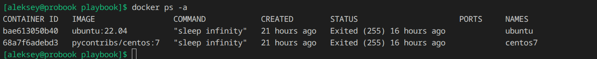
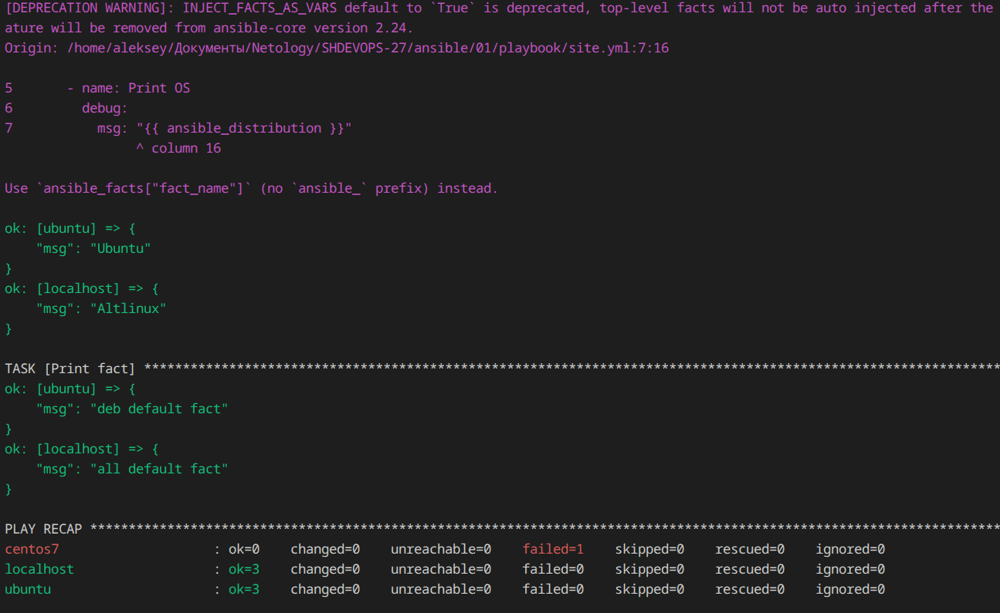

## Домашнее задание к занятию 1 «Введение в Ansible»

* [Installing Ansible](https://docs.ansible.com/projects/ansible/latest/playbook_guide/playbooks_variables.html#id16)

* [Приоритеты переменных](https://docs.ansible.com/projects/ansible/latest/playbook_guide/playbooks_variables.html#id16)

### Подготовка к выполнению

```bash
curl https://bootstrap.pypa.io/get-pip.py -o get-pip.py
python3 get-pip.py --user
echo 'export PATH="$HOME/.local/bin:$PATH"' >> ~/.bashrc && source ~/.bashrc
```



```bash
python3 -m pip install --user ansible
```



### Основная часть

1. 


2. 


3. 


```bash
docker run -d --name centos7 pycontribs/centos:7 sleep infinity
docker run -d --name ubuntu ubuntu:22.04 sleep infinity
docker exec -u 0 ubuntu apt-get update && docker exec -u 0 ubuntu apt-get install -y python3
```

4. 



7. 

```bash
ansible-vault encrypt group_vars/deb/examp.yml
```

8. 

```bash
ansible-playbook -i inventory/prod.yml site.yml --ask-vault-pass
```

9. 

```bash
ansible-doc -t connection -l
ansible-doc -t connection local
ansible-doc -t connection docker
```

### Необязательная часть

