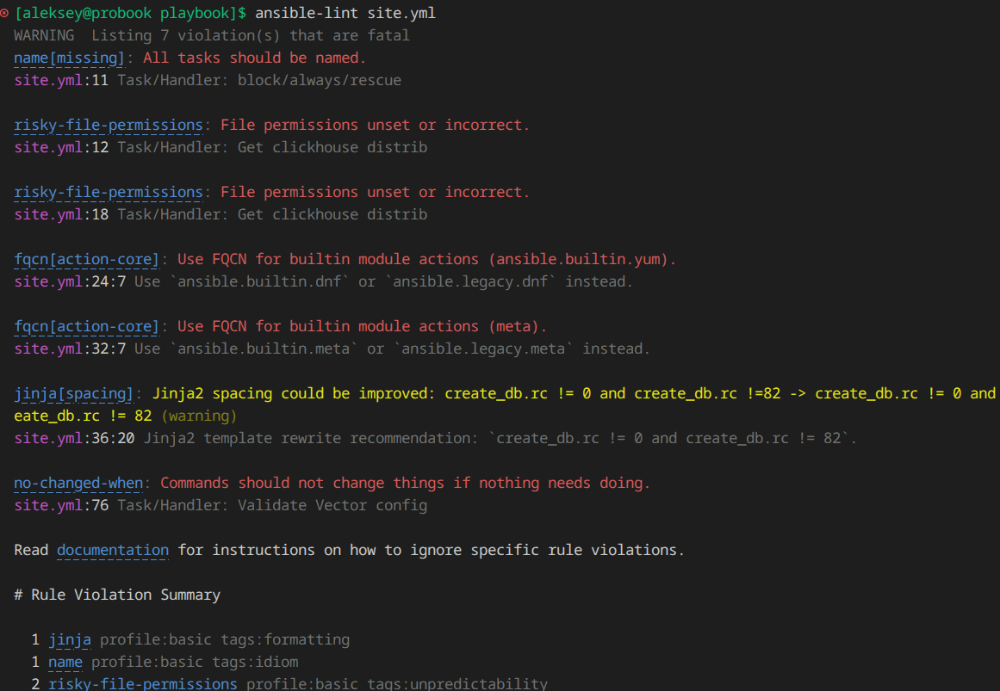
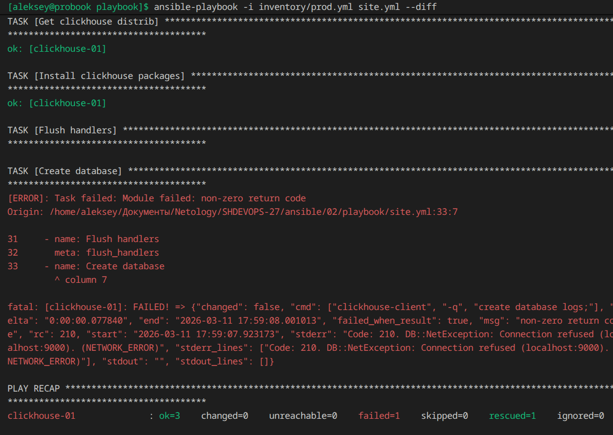

## Домашнее задание к занятию 2 «Работа с Playbook»

### Подготовка к выполнению

[Что такое ClickHouse?](https://clickhouse.com/docs/ru/intro)

[What is Vector?](https://github.com/vectordotdev/vector)

### Основная часть

1. 

```yaml
clickhouse:
  hosts:
    clickhouse-01:
      ansible_host: redos8
      ansible_connection: docker
      ansible_user: root
      # ansible_host: <IP_here>
vector:
  hosts:
    vector-01:
      ansible_host: redos8
      ansible_connection: docker
      ansible_user: root
```

2. 

```yaml
data_dir: /var/lib/vector

sources:
  dummy_logs:
    type: demo_logs
    format: json
    interval: 1.0

sinks:
  out_console:
    type: console
    inputs: [dummy_logs]
    target: stdout
    encoding:
      codec: json
```

5. 



8. 


