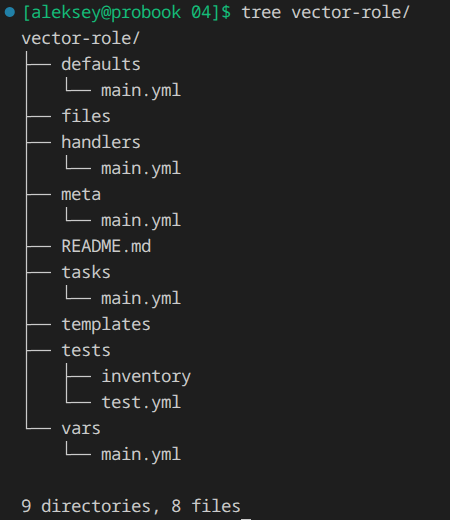

## Домашнее задание к занятию 4 «Работа с roles»

1. [Ansible roles](https://galaxy.ansible.com/ui/standalone/roles/)

2. [Ansible Lint Documentation](https://docs.ansible.com/projects/lint/)

3. [Indexes of all modules and plugins](https://docs.ansible.com/projects/ansible/latest/collections/all_plugins.html)

4. [Integrating Vector with ClickHouse](https://clickhouse.com/docs/ru/integrations/vector)

### Подготовка к ваполнению

1. https://github.com/aleksey-dubrovin/vector-role

2. https://github.com/aleksey-dubrovin/lighthouse-role

3. 

Подготовка окружения
```bash
mkdir -p playbooks roles collections inventories && touch ansible.cfg requirements.yml .gitignore
```

Подготовка модулей
```bash
#!/bin/bash
set -e

echo "🔄 Установка Yandex Cloud SDK..."
pip install "yandexcloud>=0.10.1"

echo "🔄 Клонирование модулей arenadata..."
mkdir -p .external/arenadata
if [ ! -d ".external/arenadata/ansible-module-yandex-cloud/.git" ]; then
    git clone https://github.com/arenadata/ansible-module-yandex-cloud \
        .external/arenadata/ansible-module-yandex-cloud
fi

echo "🔄 Копирование модулей в проект..."
# Копируем модули в локальную директорию library
mkdir -p library
cp -r .external/arenadata/ansible-module-yandex-cloud/modules/* library/
cp -r .external/arenadata/ansible-module-yandex-cloud/module_utils/* module_utils/ 2>/dev/null || true

echo "✅ Модули Yandex Cloud установлены!"
```

Добавление inventory-плагина yc_compute

```bash
mkdir -p inventory_plugins
curl -o inventory_plugins/yc_compute.py \
  https://raw.githubusercontent.com/st8f/community.general/yc_compute/plugins/inventory/yc_compute.py
chmod 644 inventory_plugins/yc_compute.py
```

### Основная часть 

1. 

```bash
ansible-galaxy install -r requirements.yml -p .
```

2. 


3. 



4. 

