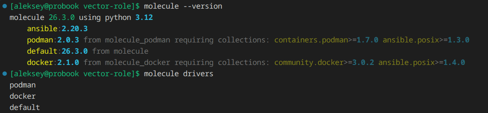
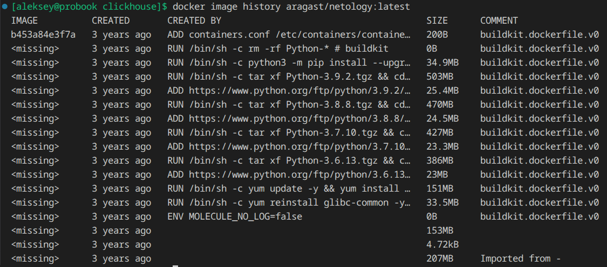
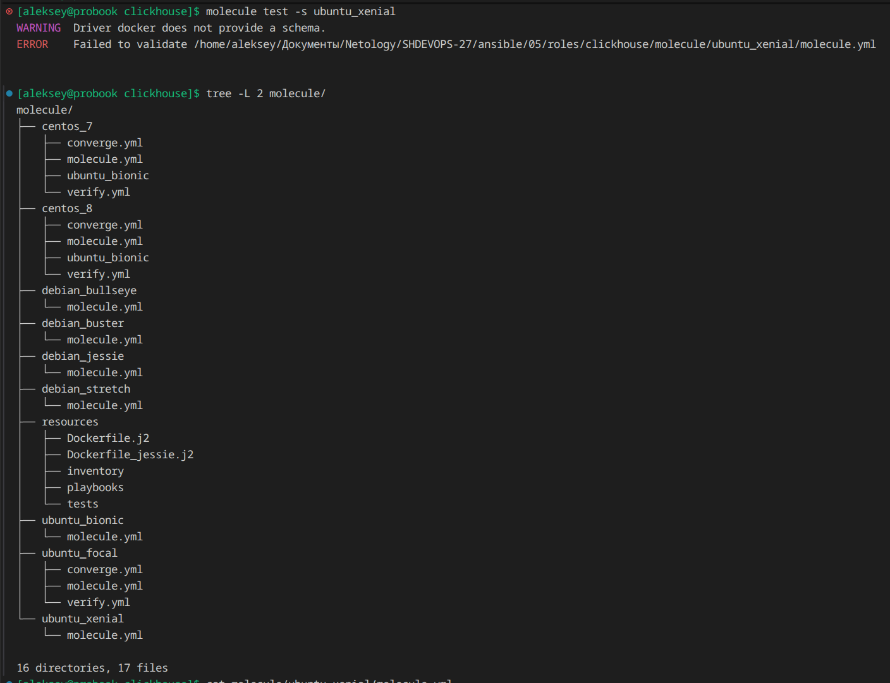
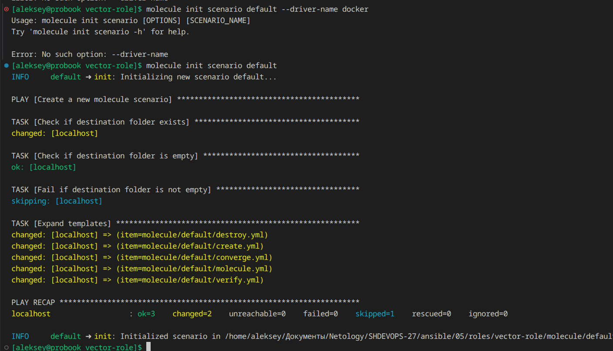
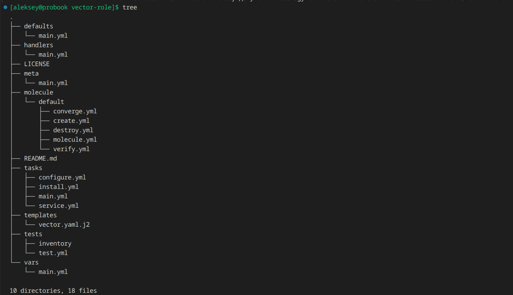
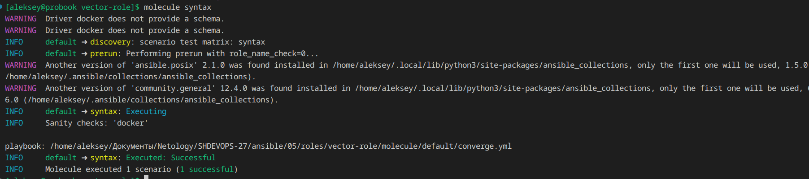
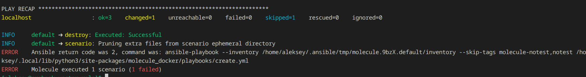

## Домашнее задание к занятию 5 «Тестирование roles»

[Playbook Testing](https://docs.ansible.com/projects/molecule/getting-started-playbooks/)
[TOX](https://tox.wiki/en/latest/)

### Подготовка к выполнению

1. Установите molecule и его драйвера:

```bash
pip3 install molecule molecule_docker molecule_podman
```


2. Выполните установк образа с podman, tox и несколькими пайтонами (3.7 и 3.9) внутри.

```bash
docker pull aragast/netology:latest
```


### Основная часть

1. Настройка окружения для теста и тестирование роли Clickhouse

```bash
mkdir -p roles inventories && touch ansible.cfg requirements.yml .gitignore
ansible-galaxy install -r requirements.yml -p ./roles
```


2. Настройка тестирования для роли Vector

```bash
molecule init scenario default
```


Структура директорий


3. Запуск сценария теста и проверка результатов Molecule

Проверка синтаксиса
```bash
molecule syntax
```


Тестирование
```bash
molecule test
```


4. Запуск сценария теста и проверка результатов Molecule

