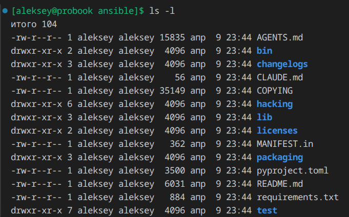
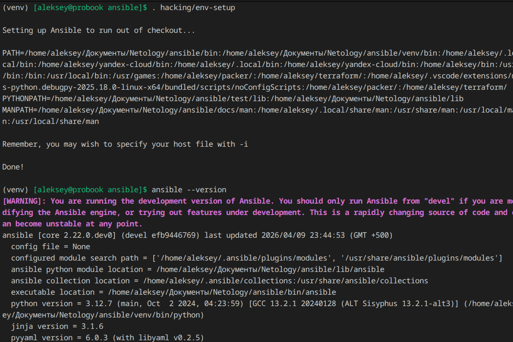
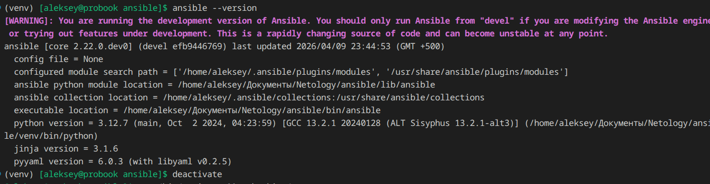
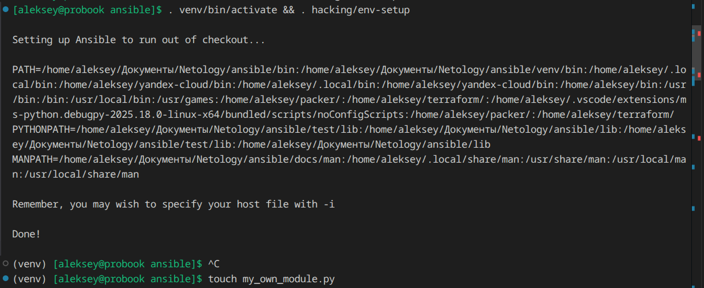
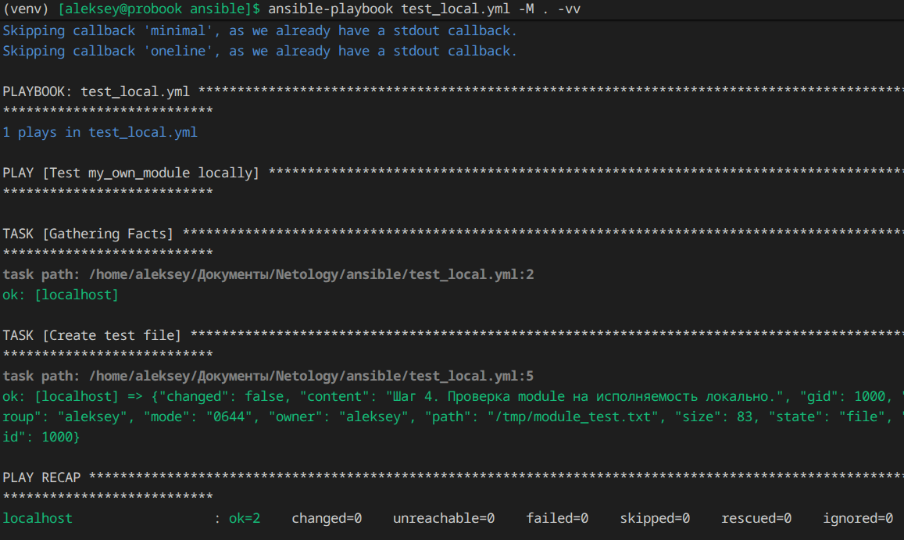
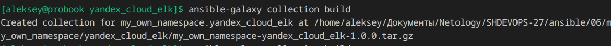
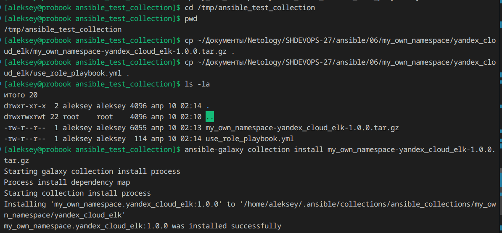
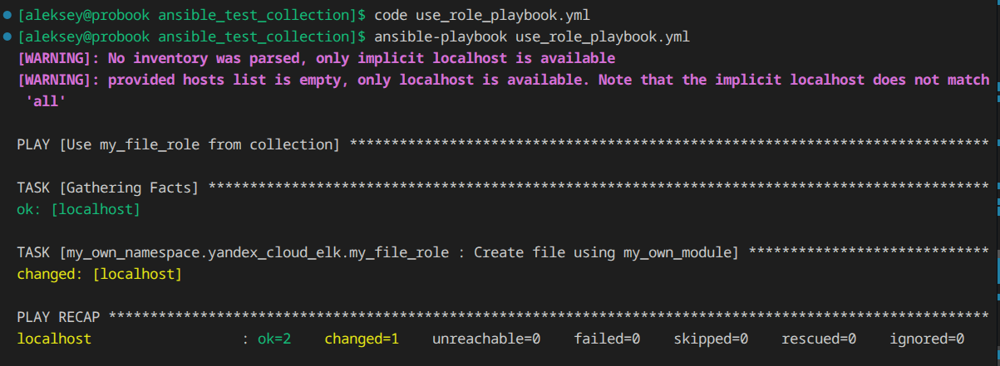

## Домашнее задание к занятию 6 «Создание собственных модулей»

Презентация [cоздание собственных модулей](./6.Создание_собственных_модулей.pdf)

Полное описание типов module в [Ansible module architecture](https://docs.ansible.com/projects/ansible/latest/dev_guide/developing_program_flow_modules.html#types-of-modules)

[Гайд о сохранении совместимости между разными версиями Python и единая база кода](http://python3porting.com/)

[Пример шаблона модуля](https://docs.ansible.com/projects/ansible/latest/dev_guide/developing_modules_general.html#creating-a-module)

### Подготовка к выполнению

1. `cd ansible`.

2. `pip install -r requirements.txt`.

3. `. hacking/env-setup`.

4. `deactivate` 

5. `. venv/bin/activate && . hacking/env-setup`.

### Основная часть

1. Создаем файл модуля, редактируем под задачу и тестируем в playbook на выполнение.

2. Выполняем проверку на идемпотентность.

4. Создаем коллекцию, создаем роль для использования модуля, заполняем документацию и выполняем сборку.

5. Переносим архив во временную директорию, проверяем установку коллекции.

6. Редактируем основной playbook и выполняем запуск.

7. Принимаем изменения и отправляем в git.

[Ссылка на репозиорий с коллекцией](https://github.com/aleksey-dubrovin/SHDEVOPS-27/blob/main/ansible/06/my_own_namespace/yandex_cloud_elk/README.md)

[Ссылка на архив с коллекцией](https://github.com/aleksey-dubrovin/SHDEVOPS-27/blob/main/ansible/06/my_own_namespace/yandex_cloud_elk/my_own_namespace-yandex_cloud_elk-1.0.0.tar.gz)
