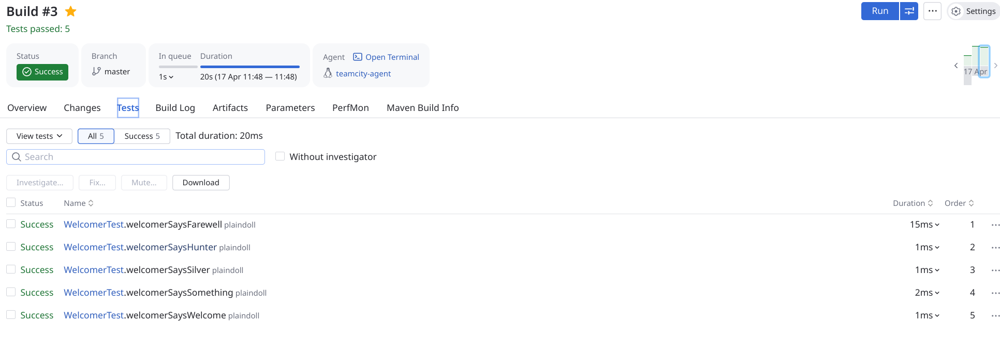
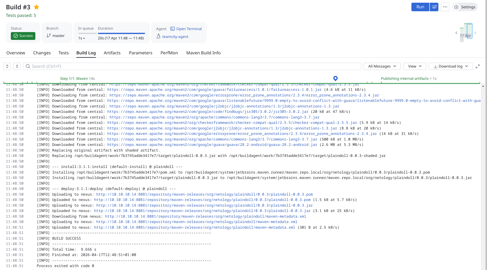
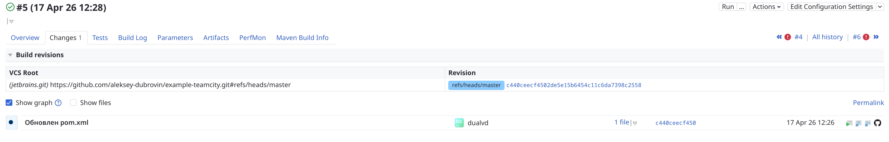
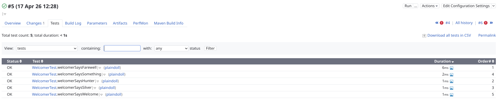
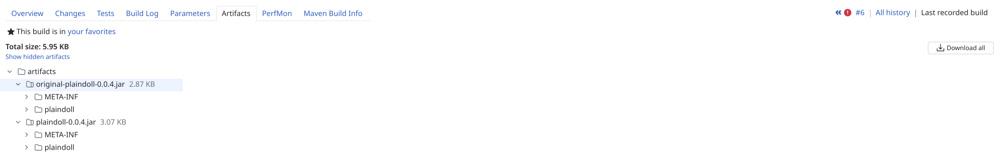

## Непрерывная разработка и интеграция

[Жизненный цикл ПО](7.Жизненный_цикл_ПО.pdf)

[Кто такие DevOps и SRE](8.DevOps_и_SRE.pdf)

[Процессы CI/CD](9.Процессы_CI_CD.pdf)

[Знакомство с Jenkins](10.Jenkins.pdf)

[Знакомсто с TeamCity](11.Teamcity.pdf)

[Знакомство с GitLab](12.Gitlab.pdf)

## Домашнее задание к занятию 11 «Teamcity»

1. Создание инстанцов teamcity server и teamcity agent, развертывание репозитория nexus.

2. Cборка и загрузка в nexus

3. Подготовка новой версии в branch и сборка по merge

4. Включение сборки артефактов

