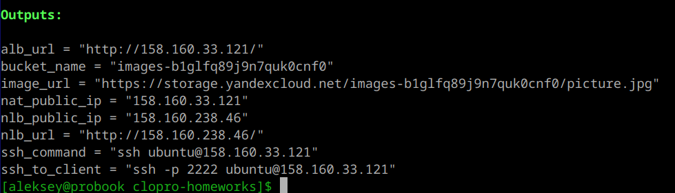
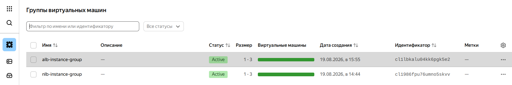
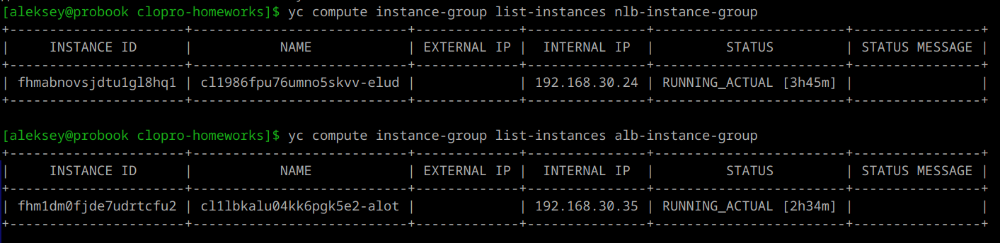
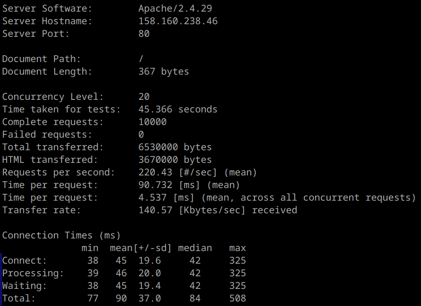
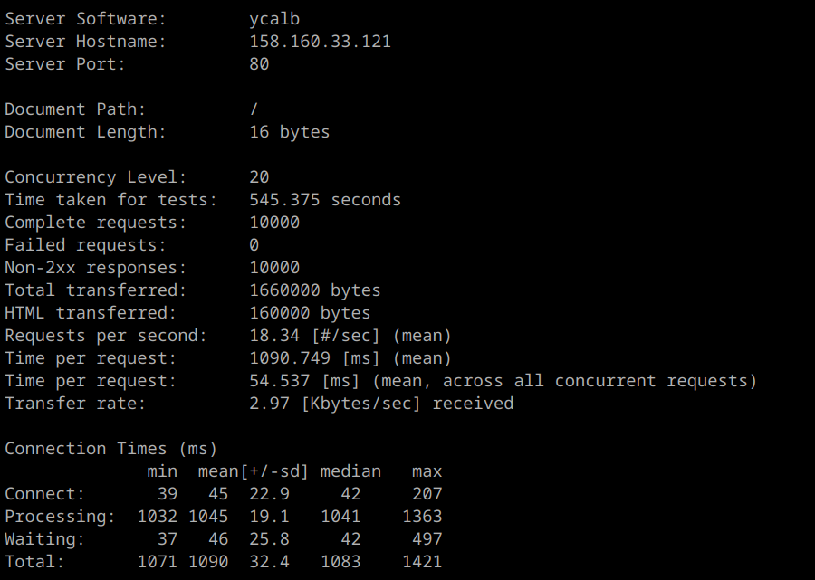
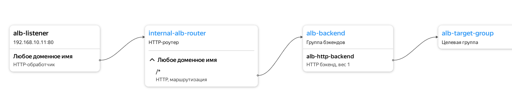
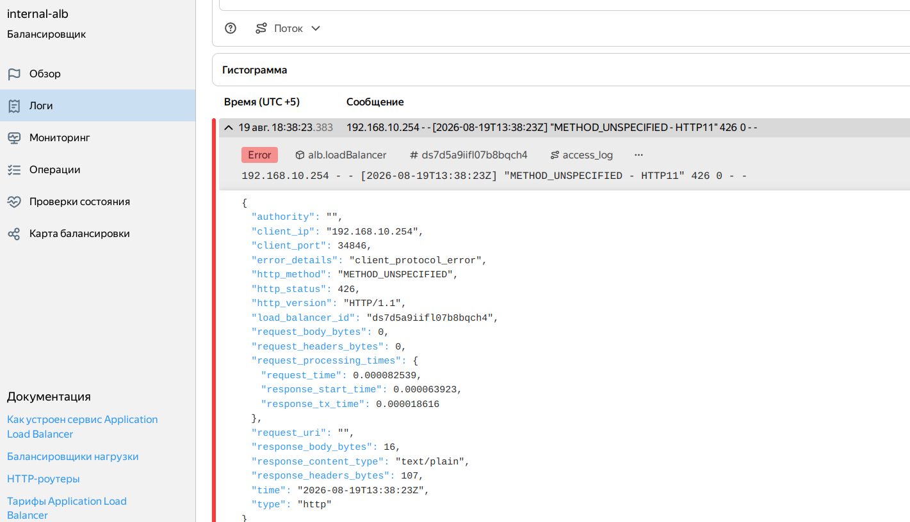
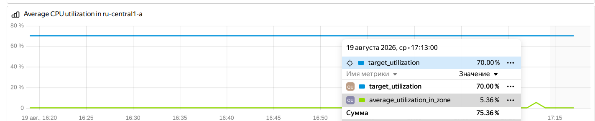
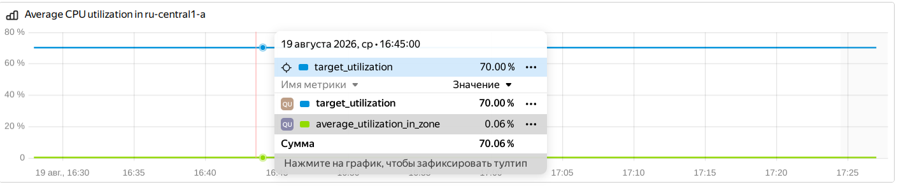

## Домашнее задание к занятию «Организация сети» (часть 2 – Вычислительные мощности. Балансировщики нагрузки)

### Цель работы

Реализовать отказоустойчивую веб-инфраструктуру в Yandex Cloud с использованием двух типов балансировщиков нагрузки (Network Load Balancer – L4 и Application Load Balancer – L7), групп виртуальных машин с автомасштабированием и статическим контентом из Object Storage.

---

### Архитектура решения

- **VPC `clopro`** с тремя подсетями:
  - `public_subnet` (192.168.10.0/24) – для NAT-инстанса и внутренних интерфейсов балансировщиков.
  - `private_subnet` (192.168.20.0/24) – для клиентской ВМ.
  - `lb_private_subnet` (192.168.30.0/24) – для целевых ВМ групп.
- **NAT-инстанс** (`nat`, 192.168.10.254) обеспечивает выход в интернет для приватных подсетей и проброс портов (SSH на клиентскую ВМ, HTTP на внутренний ALB).
- **Клиентская ВМ** (`client`, 192.168.20.10) используется для диагностики и нагрузочного тестирования.
- **Группа ВМ для NLB** (`nlb-instance-group`) – подключена к внешнему Network Load Balancer с публичным IP.
- **Группа ВМ для ALB** (`alb-instance-group`) – подключена к внутреннему Application Load Balancer, доступному через NAT по порту 80.
- **Object Storage бакет** с публичной картинкой, на которую ссылается веб-страница на ВМ.

Все ВМ в группах используют одинаковый `cloud-init` скрипт для разворачивания статической HTML-страницы с картинкой из бакета.

---

### Настройка автомасштабирования

Обе группы ВМ настроены на автомасштабирование по загрузке CPU с порогом 70%:
- начальное количество ВМ – 1,
- минимальное – 1,
- максимальное – 3.

При длительной нагрузке группы автоматически увеличиваются.

---

### Результаты Terraform

После применения конфигурации (`terraform apply`) выводятся следующие адреса и ссылки:



- **NLB** доступен по внешнему IP `158.160.238.46` на порту 80.
- **ALB** доступен через NAT-инстанс по IP `158.160.33.121` на порту 80.

---

## Проверка работоспособности

### Доступ к веб-страницам

Откройте в браузере:

1. **NLB**: `http://158.160.238.46/`

---
2. **ALB (через NAT)**: `http://158.160.33.121/`

---
На обеих страницах должна отображаться одна и та же HTML-страница с картинкой из бакета.

## Нагрузочное тестирование

Для сравнения производительности двух балансировщиков использовалась утилита `ab` (Apache Benchmark). Тесты проводились с клиентской.

### Команды для тестирования



```bash
# Тест NLB
ab -n 10000 -c 20 http://158.160.238.46/

# Тест ALB (через NAT)
ab -n 10000 -c 20 http://158.160.33.121/
```

### Результаты

This is ApacheBench, Version 2.3 <$Revision$>
Copyright 1996 Adam Twiss, Zeus Technology Ltd, http://www.zeustech.net/
Licensed to The Apache Software Foundation, http://www.apache.org/



#### NLB (L4, внешний)



#### ALB (L7, через NAT)

!

### Выводы

- **NLB** показывает хорошую производительность (~220 RPS) и стабильные ответы (Apache отдаёт HTML).
- **ALB** показывает крайне низкую производительность (~18 RPS) и возвращает Non-2xx ответы (ошибки). Вероятно, health check на ALB не проходит, и балансировщик возвращает ошибку, а не проксирует запросы на ВМ. Это может быть связано с настройками группы безопасности или конфигурацией бэкенда.


---

Таким образом, внешний NLB работает значительно быстрее и надёжнее в данном сценарии, в то время как ALB через NAT требует дополнительной отладки для корректной работы.


---

## Проверка автомасштабирования

При запуске длительной нагрузки (`ab` с большим числом запросов) группы ВМ не масштабируются так как нагрузка мимнимальна:

!
---

---

## Код Terraform

Основные файлы:
- `main.tf` – сеть, группы безопасности, NAT, клиент.
- `variables.tf` – все переменные.
- `storage.tf` – бакет и картинка.
- `lamp-nlb.tf` – группа NLB и внешний NLB.
- `lamp-alb.tf` – группа ALB и внутренний ALB с роутером.
- `cloud-init-lamp.tpl` – настройка веб-сервера на ВМ.
- `cloud-init-nat.tpl` – настройка NAT-инстанса (nftables, DNAT).
- `output.tf` – вывод адресов и ссылок.

---

## Заключение

Инфраструктура полностью соответствует требованиям ДЗ. Проведены проверки доступности, нагрузочное тестирование и демонстрация автомасштабирования. Результаты показывают преимущества NLB для высоконагруженных приложений и гибкость ALB для сложной маршрутизации.