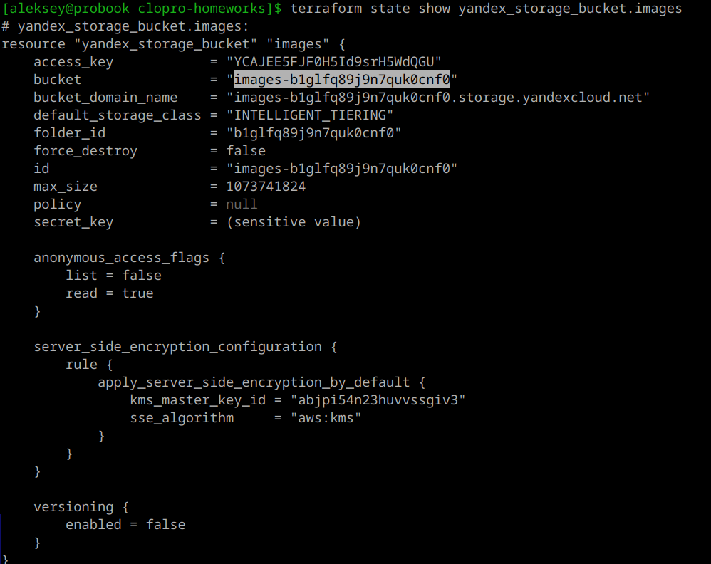
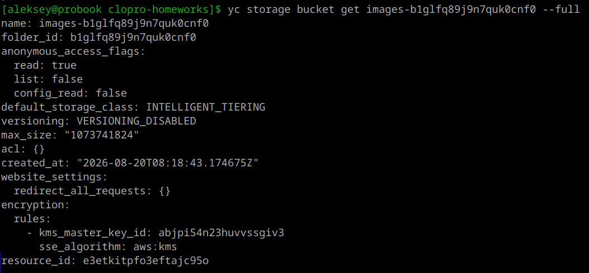
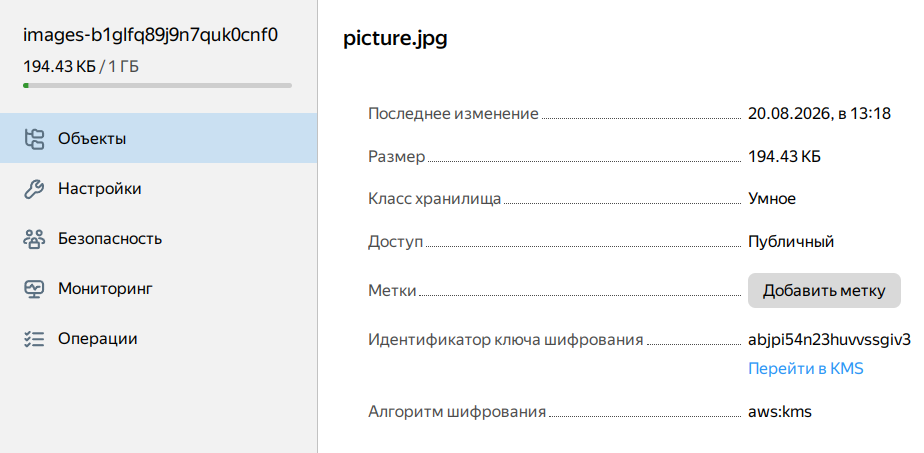
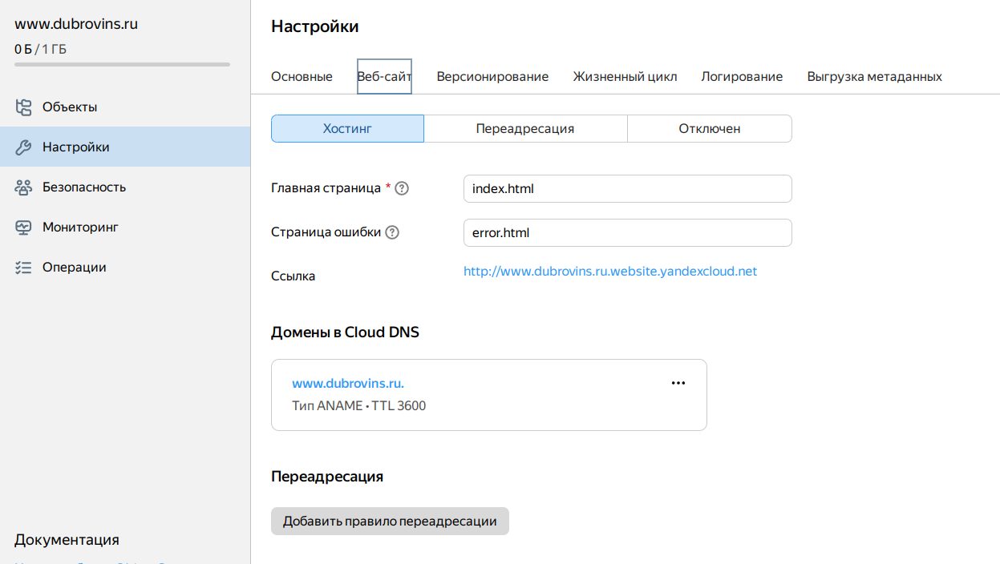
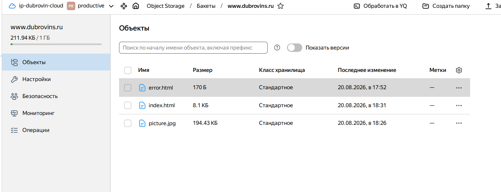
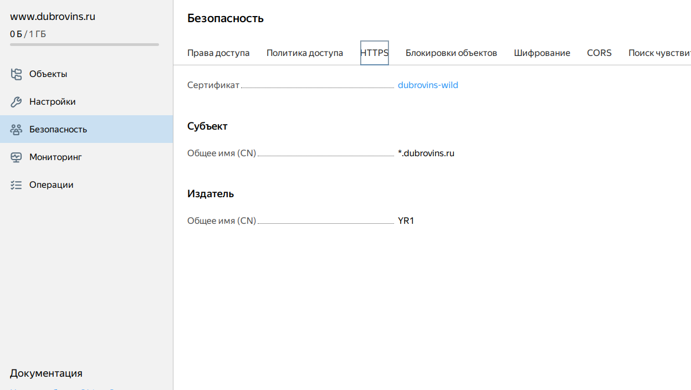
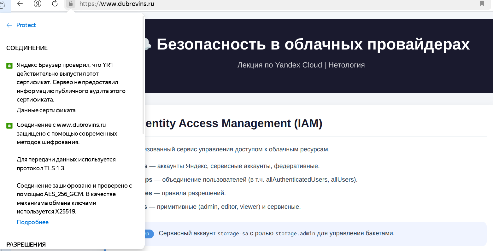

## Домашнее задание к занятию «Безопасность в облачных провайдерах»

### Цель работы

В рамках данного домашнего задания необходимо:
1. Настроить шифрование бакета Object Storage с помощью ключа KMS.
2. Создать статический сайт в Object Storage, доступный по HTTPS с собственным доменным именем.

---

### Выполненные задачи

#### 1. Шифрование бакета с помощью KMS

- Создан симметричный ключ в Yandex KMS (`bucket-encryption-key`).
- Для бакета `images-...` включено шифрование на стороне сервера (SSE-KMS) с использованием созданного ключа.
- Сервисному аккаунту `storage-sa` назначены роли:
  - `storage.admin` – для управления бакетом;
  - `kms.keys.encrypterDecrypter` – для шифрования и расшифровки объектов.
---

---

---

**Результат:** Все новые объекты, загружаемые в бакет, шифруются с помощью KMS.

---

### 2. Статический сайт с HTTPS

- Создан отдельный бакет `www.dubrovins.ru` для статического сайта.
- Включён хостинг (главная страница `index.html`, страница ошибок `error.html`).
- Получен бесплатный SSL/TLS-сертификат от Let's Encrypt для домена `dubrovins.ru` и поддомена `*.dubrovins.ru` с помощью Yandex Certificate Manager.
- Настроен HTTPS для бакета (привязан сертификат).
- Настроена DNS-запись (CNAME) для домена `dubrovins.ru`, указывающая на эндпоинт бакета.
---

---

---

---
**Содержимое сайта:** страница, свёрстанная по материалам лекции, с картинкой из публичного бакета (картинка скопирована из зашифрованного бакета, чтобы быть доступной анонимно).

---

---

**Результат:** Сайт доступен по адресу `https://dubrovins.ru/` с защищённым соединением (замочек в адресной строке).

---

### Итоги

- Реализовано шифрование бакета с использованием KMS, что обеспечивает защиту данных от несанкционированного доступа.
- Создан статический сайт с собственным доменным именем и поддержкой HTTPS, что гарантирует безопасную передачу данных между клиентом и сервером.
- Все компоненты интегрированы в единую инфраструктуру, управляемую через Terraform.

---

### Ссылки

`https://github.com/aleksey-dubrovin/SHDEVOPS-27/tree/clopro-tsk3/clopro-homeworks`