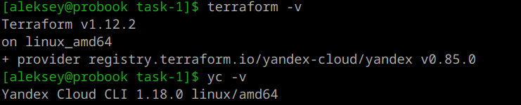
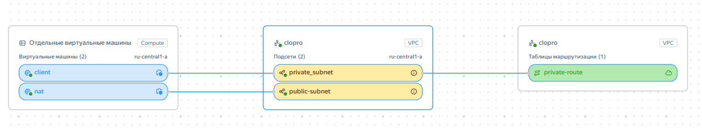
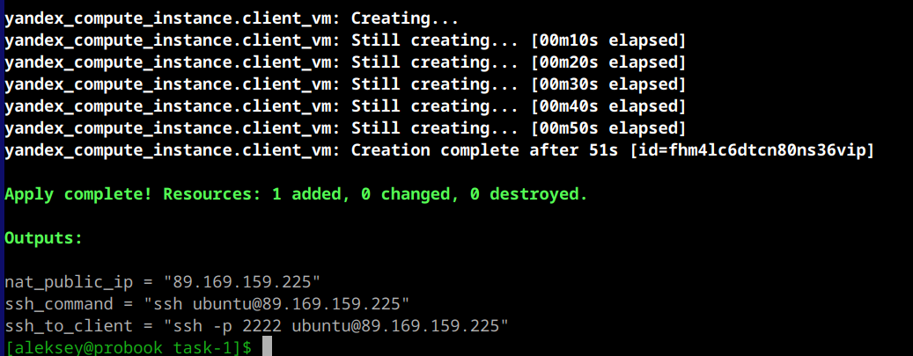
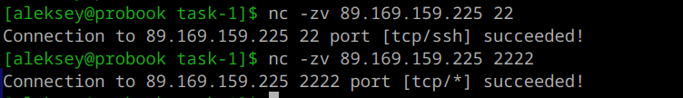
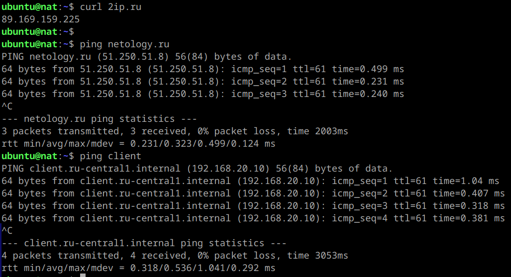
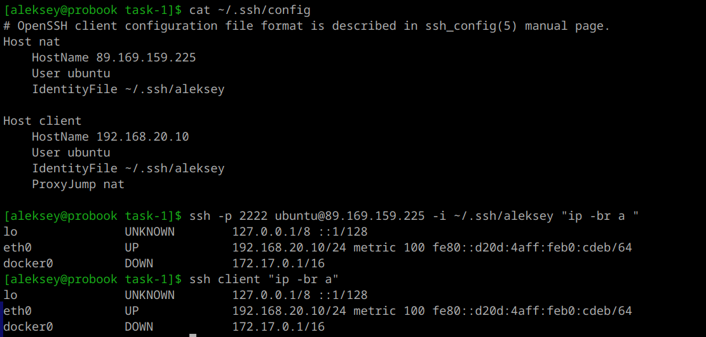
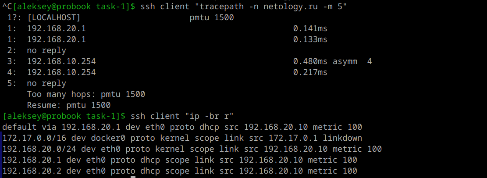

# Домашнее задание к занятию «Организация сети»

## Описание задания

В рамках ДЗ необходимо создать сетевую инфраструктуру в Yandex Cloud с использованием Terraform, состоящую из:

- VPC с одной публичной и одной приватной подсетью.
- NAT-инстанса в публичной подсети с фиксированным внутренним IP `192.168.10.254`.
- Публичной виртуальной машины (с доступом из интернета) для проверки выхода в интернет.
- Приватной виртуальной машины без публичного IP, доступ к которой осуществляется через публичную ВМ.
- Таблицы маршрутизации для приватной подсети, направляющей весь трафик в NAT-инстанс.
- Проверки доступа в интернет с обеих ВМ.

Дополнительно реализованы:
- Проброс портов через NAT-инстанс с помощью nftables (SSH на приватную ВМ через порт 2222).
- Группы безопасности с тонкой настройкой правил.
---

### 1. Подготовка окружения

- Установил Terraform (≥ 1.5.0).

- Установил Yandex Cloud CLI.
- Создал сервисный аккаунт, получил токент, идентификатор облака и каталога.
- Сгенерировал SSH-ключ.

### 2. Настройка переменных

В файл `terraform.tfvars` в корне проекта внес все чуствительные данные:

```hcl
yc_token     = "oauth_токен"
yc_cloud_id  = "идентификатор_облака"
yc_folder_id = "идентификатор_каталога"
yc_zone      = "ru-central1-a"   # или другая зона
public_ssh_key_path = "~/.ssh/id_rsa.pub"
secure_password     = "пароль_для_пользователя"   
```

### 3. Инициализация и применение

```bash
terraform init
terraform plan   
terraform apply
```


После успешного применения Terraform вывел IP-адреса и команды для подключения.


---

## Проверка результатов

### 1. Подключение к публичной ВМ и проверка интернета



**Ожидаемый результат:** пинг проходит, интернет доступен.


---

### 2. Подключение к приватной ВМ через публичную ВМ (прыжок)

Внес параметры в файл подключении ssh и выполнил проверу



**Ожидаемый результат:** пинг проходит, трафик идёт через NAT-инстанс.

---

### 3. Проверка таблиц маршрутизации

На приватной ВМ проверяю доступность и маршрут до ресурсов в интернет.



---

## Итог

Инфраструктура полностью соответствует требованиям ДЗ.
