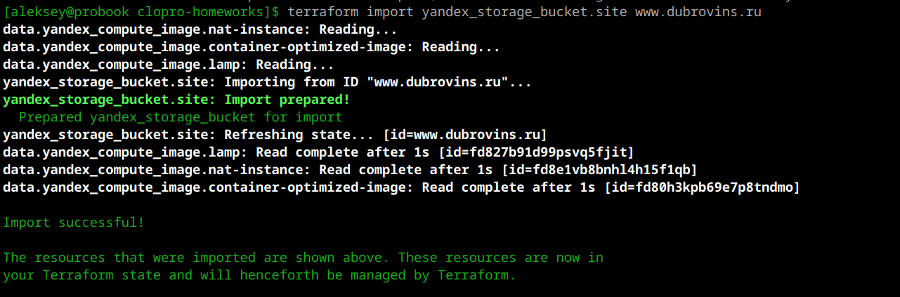
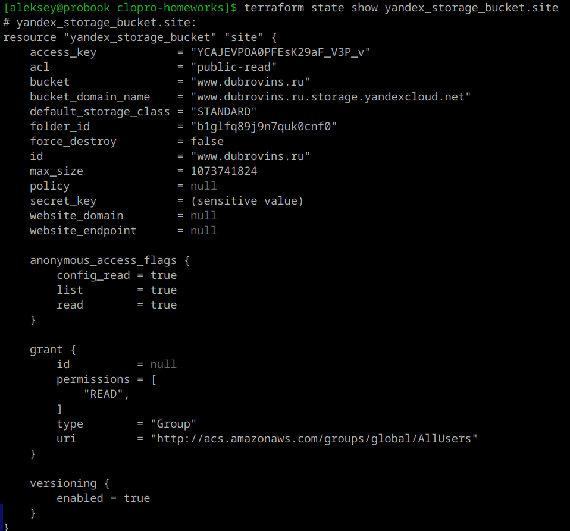
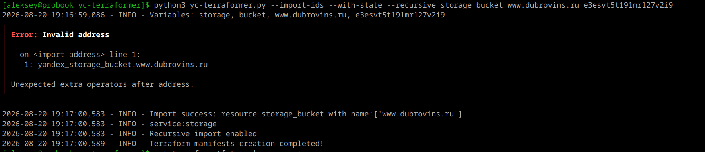

## Домашнее задание к занятию «Безопасность в облачных провайдерах»

### Цель работы

В рамках данного домашнего задания необходимо:
1. Настроить шифрование бакета Object Storage с помощью ключа KMS.
2. Создать статический сайт в Object Storage, доступный по HTTPS с собственным доменным именем.

---

### Выполненные задачи

#### 1. Шифрование бакета с помощью KMS

- Создан симметричный ключ в Yandex KMS (`bucket-encryption-key`).
- Для бакета `images-...` включено шифрование на стороне сервера (SSE-KMS) с использованием созданного ключа.
- Сервисному аккаунту `storage-sa` назначены роли:
  - `storage.admin` – для управления бакетом;
  - `kms.keys.encrypterDecrypter` – для шифрования и расшифровки объектов.
---

---

---

**Результат:** Все новые объекты, загружаемые в бакет, шифруются с помощью KMS.

---

### 2. Статический сайт с HTTPS

- Создан отдельный бакет `www.dubrovins.ru` для статического сайта.
- Включён хостинг (главная страница `index.html`, страница ошибок `error.html`).
- Получен бесплатный SSL/TLS-сертификат от Let's Encrypt для домена `dubrovins.ru` и поддомена `*.dubrovins.ru` с помощью Yandex Certificate Manager.
- Настроен HTTPS для бакета (привязан сертификат).
- Настроена DNS-запись (CNAME) для домена `dubrovins.ru`, указывающая на эндпоинт бакета.
---

---

---

---
**Содержимое сайта:** страница, свёрстанная по материалам лекции, с картинкой из публичного бакета (картинка скопирована из зашифрованного бакета, чтобы быть доступной анонимно).

---

---

**Результат:** Сайт доступен по адресу `https://dubrovins.ru/` с защищённым соединением (замочек в адресной строке).

---

### Импорт существующих ресурсов в Terraform

При выполнении третьего домашнего задания я столкнулся с ситуацией, когда бакет для статического сайта (`www.dubrovins.ru`) уже был создан и настроен вручную через консоль Yandex Cloud. Чтобы включить этот ресурс в управление Terraform, потребовался импорт.

### Зачем это нужно

Terraform позволяет импортировать уже существующие ресурсы в управление, чтобы:
- Не пересоздавать ресурс, который уже работает.
- Добавить в инфраструктуру как код (IaC) ресурсы, созданные вручную.
- Избежать простоев и потери данных при переносе под управление Terraform.

### Как выполнялся импорт

Импорт бакета выполнялся командой:
```bash
terraform import yandex_storage_bucket.site www.dubrovins.ru
```

Здесь:
- `yandex_storage_bucket.site` — адрес ресурса в конфигурации Terraform.
- `www.dubrovins.ru` — реальное имя бакета в облаке.

### Возникшие сложности

#### 1. Конфликт с существующим ресурсом в состоянии
При первой попытке импорта Terraform сообщил, что ресурс уже управляется:
```
Error: Resource already managed by Terraform
```
Пришлось удалить существующую запись из состояния:
```bash
terraform state rm yandex_storage_bucket.site
```
После импорта возникла ошибка:
```
Error: error getting storage client: failed to get default storage client
```
Причина: провайдер Yandex Cloud по умолчанию пытается использовать IAM-токен для доступа к Object Storage, но для управления бакетами требуются статические ключи доступа.

---

---
Настройки заданные вручную не отобразились и после применения откатились

---

---

### Альтернативный инструмент: yc-terraformer

Для импорта сложных ресурсов со всеми зависимостями можно использовать утилиту `yc-terraformer`. Она автоматически генерирует Terraform-манифесты для существующих ресурсов в Yandex Cloud.

Команда для импорта бакета:
```bash
python3 yc-terraformer.py --import-ids --with-state --recursive storage bucket www.dubrovins.ru
```
---

---
Однако при работе с этой утилитой возникли ошибки, связанные с отсутствием файла `terraform.tfstate` и некорректным именем ресурса (точки в имени). Поэтому был выбран более простой и надёжный способ — стандартный `terraform import`.

### Результат

После успешного импорта бакет `www.dubrovins.ru` появился в файле состояния `terraform.tfstate`. Теперь Terraform управляет этим ресурсом, а все его настройки (хостинг, HTTPS, сертификат) могут быть описаны в коде.

---

## Выводы

Импорт ресурсов — полезный механизм для постепенного перевода существующей инфраструктуры под управление Terraform. Важно помнить:
- Для Object Storage требуются статические ключи доступа в конфигурации провайдера.
- При импорте бакета Terraform устанавливает `force_destroy = false` в состоянии, поэтому при необходимости это значение нужно обновить через `terraform apply`.
- `yc-terraformer` может быть полезен для массового импорта, но требует дополнительной настройки.

### Итоги

- Реализовано шифрование бакета с использованием KMS, что обеспечивает защиту данных от несанкционированного доступа.
- Создан статический сайт с собственным доменным именем и поддержкой HTTPS, что гарантирует безопасную передачу данных между клиентом и сервером.
- Все компоненты интегрированы в единую инфраструктуру, управляемую через Terraform.

---

### Ссылки

`https://github.com/aleksey-dubrovin/SHDEVOPS-27/tree/clopro-tsk3/clopro-homeworks`