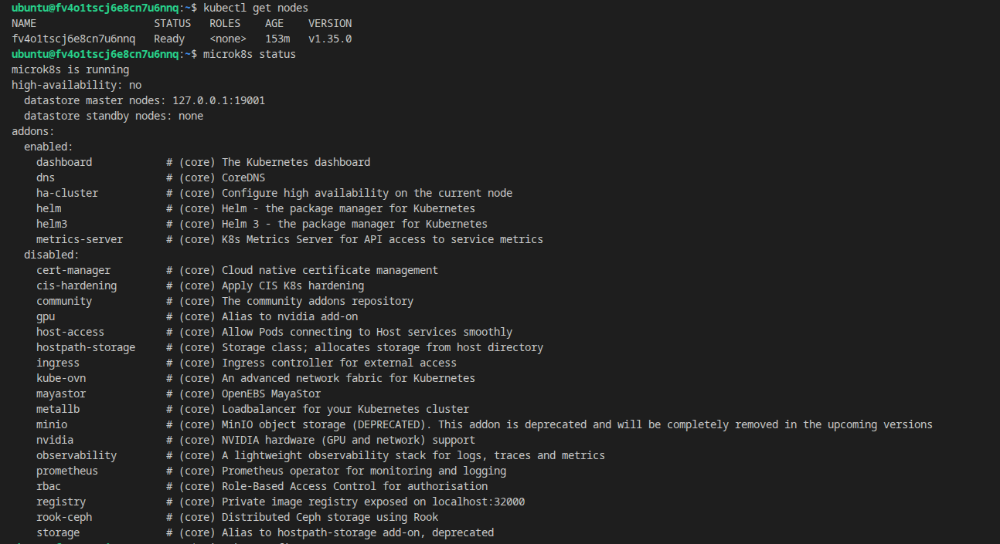
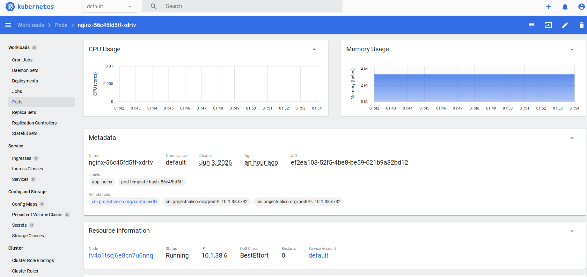
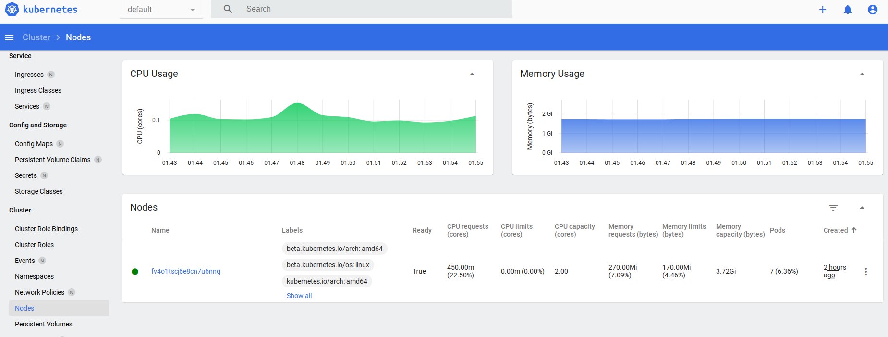
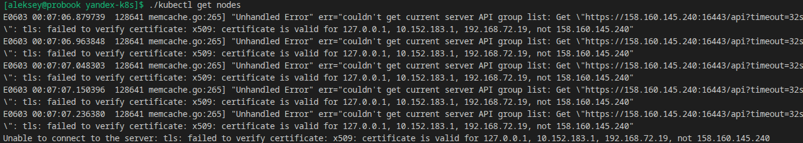
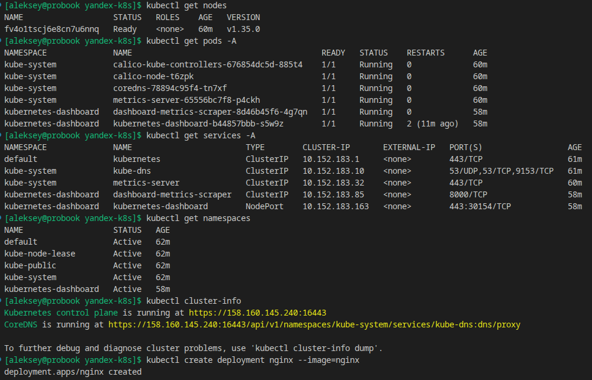

# Kubernetes: основы, применение и администрирование

[Kubernetes. Причины появления. Команда kubectl](SHKUBER-9__Kubernetes._Причины_появления._Команда_kubectl.pdf)

[Базовые объекты K8S](Базовые_объекты_K8s.pdf)

[Запуск приложений в K8S](Запуск_приложений_в_K8s.pdf)

[Сетевое взаимодействие в Kubernetes](Сетевое_взаимодействие_в_K8s.pdf)

[Хранение в K8s](Хранение_в_K8s.pdf)

[Настройка приложений](Настройка_приложений_и_управление_доступом.pdf)

[Helm](shkuber-27_Helm.pdf)

[Компоненты Kubernetes]()

[Установка Kubernetes с помощью kubeadm, kubespray]()

[Как работает сеть в K8S]()

[Обновление приложений]()

[Troubleshooting]()

## Домашнее задание к занятию «Kubernetes. Причины появления. Команда kubectl»
Для выполнения задания развертывания решил использовать ВМ в облаке Yandex Cloud. С помощью инструмента terraform и готовых команд установки microk8s на сайте поддержки, через cloud-init выполняется первоначальная установка необходимых компонентов. Инструкцию по развертыванию можно посмотреть в репозитории: https://github.com/aleksey-dubrovin/yandex-k8s/blob/main/README.md

### Задание 1. Установка MicroK8S

Статус ноды по результату развертывания:

---

Установку dashboard включил в cloud-init, выполнил проброс порта, настройку конфигурации и генерирацию сертификата для подключения по внешнему ip-адресу. Установил по инструкции на сайте поддержки приложение nginx в качестве pod. Получаем токен для подключения и в итоге имеем рабочий дашборд с отображением данного pod:

---

---

### Задание 2. Установка и настройка локального kubectl

Скачал kubectl, выполнил настройку конфигурации скопировав с текущего кластера. Проверил доступный порт для API и пробую подключиться:

---

Добавляю внешний IP адрес в шаблон сертификата и перегененрируем сертификат. Проверяю доступ к кластеру с локальной машины и проверяем статус удаленно:

---

Ссылка на решение от Netology: https://github.com/netology-code/kuber-homeworks_1.1_reference_03.25/blob/main/README.md