# Микросервисная архитектура

1. [Введение в микросервисы](1.Введение_в_микросервисы.pdf).

2. [Микросервисы: принципы](2.Микросервисы__принципы.pdf).

3. [Микросервисы: подходы](3.Микросервисы__подходы.pdf).

4. [Микросервисы: масштабирование]().

## Домашнее задание к занятию «Введение в микросервисы»

1. Выгоды для интернет-магазина (Почему это хорошая идея):

* Масштабируемость. В «Чёрную пятницу» или при распродажах нагрузка растёт только на сервис «Корзина» или «Оплата». Можно добавить мощностей только ему, не масштабируя всю монолитную систему целиком.

* Устойчивость к ошибкам. Если упадёт сервис «Отзывы» — магазин продолжит продавать. Ошибка не «роняет» весь монолит.

* Простота развёртывания. Команда может 10 раз в день выкатывать обновление сервиса «Акции», не останавливая весь сайт. Риски ниже, частота релизов выше.

* Разные технологии. Сервис «Каталог» можно оставить на быстром Python, а «Расчёт доставки» — переписать на производительном Go.

2. Какие проблемы нужно решить в первую очередь:

* Проблемы разработки (чтобы не было хаоса):

    * Совместимость API: Как сервис «Каталог» будет отдавать товары сервису «Корзина»? Нельзя сломать формат данных.

    * Версионирование: Нужно уметь откатить только один сервис, если он сломался.

    * Автоматизация сборки и тестирования: Без CI/CD (непрерывной интеграции и поставки) новые релизы  микросервисов могут быть не качественно оттестированы ,тем самым будет нагрузка на поддержку.

* Проблемы эксплуатации (чтобы система работала 24/7):

    * Мониторинг и сбор логов: В монолите одна ошибка = один лог. В микросервисах один запрос пользователя может пройти через 5 сервисов. Нужно уметь собирать все их логи в одно место.

    * Управление настройками: Пароли к БД, ключи API должны быть централизованы, а не разбросаны по 100 сервисам.

## Домашнее задание к занятию «Микросервисы: принципы»

### Задача 1: API Gateway

API Gateway позволяет скрыть внутреннюю сложность системы от внешних потребителей. Это соответствует требованиям задачи: маршрутизация, проверки аутентификации и терминация HTTPS.

**Сравнительная таблица решений для API Gateway**

| Возможность | NGINX | Kong | Traefik | Envoy |
| :--- | :--- | :--- | :--- | :--- |
| **Маршрутизация на основе конфигурации** | Да (конфиг файл) | Да (админ API / декларативно) | Да (автоматическая, из провайдеров) | Да (конфиг файл / xDS) |
| **Проверка аутентификации** | Да (через модули: JWT, Basic Auth, внешний сервис) | Да (плагины: JWT, Key Auth, OAuth и др.) | Да (Middleware: ForwardAuth, JWT) | Да (External Authorization filter) |
| **Терминация HTTPS** | Да | Да | Да | Да |
| **Поддержка динамической маршрутизации** | Нет (после перезагрузки) | Да (через админ API) | Да (автоматически из Docker/K8s) | Да (через xDS API) |
| **Готовые клиентские библиотеки** | Нет | Да (админ API) | Да (админ API) | Да (xDS API) |
| **Поддержка инфраструктурными инструментами** | Отличная | Хорошая | Хорошая | Хорошая (в основном в k8s) |
| **Простота начальной настройки** | Высокая | Средняя | Высокая | Низкая (сложный синтаксис) |

#### Выбор

**NGINX**.

Обоснование на основе лекций:

1. **Чёткий интерфейс и забота о потребителях** – NGINX позволяет легко описать маршруты в декларативном конфиге.
2. **Обратная совместимость** – NGINX стабилен и при обновлении редко ломает конфигурации.
3. **Технологическая независимость** – не привязан к конкретному языку или платформе.
4. **Простота понимания** – для небольшой и средней инфраструктуры (как в условиях задачи) он избыточно не сложен, но даёт все необходимые функции.
5. **Безопасное поведение** – NGINX проверен временем, умеет ограничивать скорость, размер запроса, имеет модуль auth_request для вызова внешнего сервиса проверки токена.
6. **REST – отличный выбор для request/response интеграций** – NGINX лучше всего работает с HTTP/REST.

### Задача 2: Брокер сообщений

В лекции описана **событийная модель** – она даёт низкую связность, высокую гибкость, но требует брокера. Требованиям задачи лучше всего соответствует **RabbitMQ** или **Kafka**.

**Сравнительная таблица брокеров сообщений**

| Возможность | RabbitMQ | Apache Kafka | Redis Pub/Sub | NATS |
| :--- | :--- | :--- | :--- | :--- |
| **Поддержка кластеризации (надёжность)** | Да (очередь реплицируется) | Да (репликация партиций) | Да (Redis Sentinel/Cluster) | Да (кластер NATS) |
| **Хранение сообщений на диске** | Да | Да (долгое хранение) | Нет (в основном в памяти) | Да (с включением JetStream) |
| **Высокая скорость работы** | Средняя (десятки тыс. msg/s) | Очень высокая (сотни тыс. msg/s) | Очень высокая (миллионы msg/s) | Очень высокая (миллионы msg/s) |
| **Поддержка различных форматов** | Любые (как raw bytes) | Любые (Avro, JSON, Protobuf) | Любые (строки/байты) | Любые (до 1 МБ, с JetStream – больше) |
| **Разделение прав доступа** | Да (виртуальные хосты, ACL) | Да (ACL через авторизатор) | Да (пароли, встроенные ACL) | Да (учётные записи, разрешения) |
| **Простота эксплуатации** | Высокая | Сложная (требует Zookeeper/Kraft) | Высокая | Высокая |

#### Выбор

**RabbitMQ**.

Обоснование на основе лекций:

1. **Простота эксплуатации** – для большинства DevOps-команд RabbitMQ привычнее, чем Kafka «повышенные требования к инфраструктуре» ( у RabbitMQ умеренные).
2. **Хранение на диске** – есть, сообщения не теряются при перезапуске.
3. **Кластеризация** – обеспечивает отказоустойчивость (соответствует требованию «надёжности»).
4. **Гибкая маршрутизация** – поддерживает очереди, обменники, темы, что полезно для микросервисов.
5. **Поддержка разных форматов** – работает с JSON, Protobuf, XML, просто с байтами.
6. **Разделение прав** – виртуальные хосты и ACL позволяют изолировать потоки разных сервисов.
7. **Слабая связность системы** – за счёт брокера (при асинхронном взаимодействии через брокер связность ниже).

*Kafka подошла бы при требованиях «сверхвысокая пропускная способность» и «долгосрочное хранение истории», но в условии задачи они не указаны, а её эксплуатация сложнее.*

### Задача 3: API Gateway 

Создан собственный репозиторий по адресу: https://github.com/aleksey-dubrovin/micros-gateway.git , за основу взят предлагаемый в домашнем задании. При сборке обнаружились две проблемы:
#### Подготовка
- Ошибка: ImportError: cannot import name 'escape' from 'jinja2'. Старая версия Flask (1.1.1) требует старого API из Jinja2, но при установке pip ставит новую версию Jinja2, где API изменился.
    - Решение: Обновил requirements.txt для security до совместимых версий.  
- createbuckets падает с ошибкой config is not a recognized command. В новых версиях minio/mc команда config заменена на alias set.
    -  Исправил entrypoint в docker compose файле
--- 
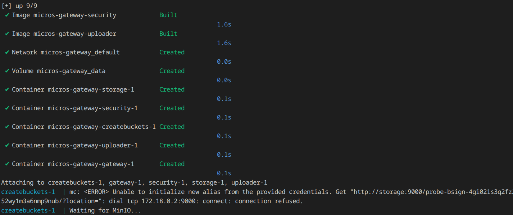
---
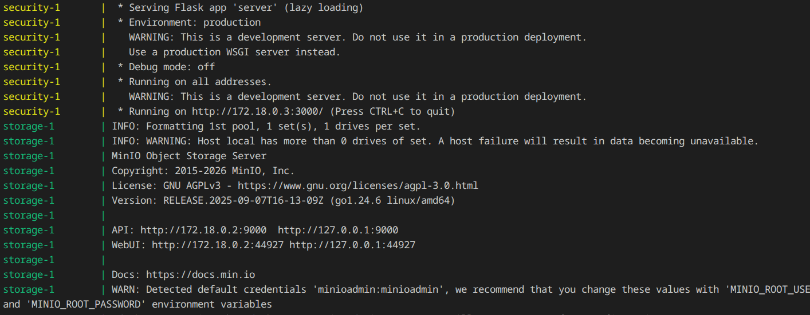
---
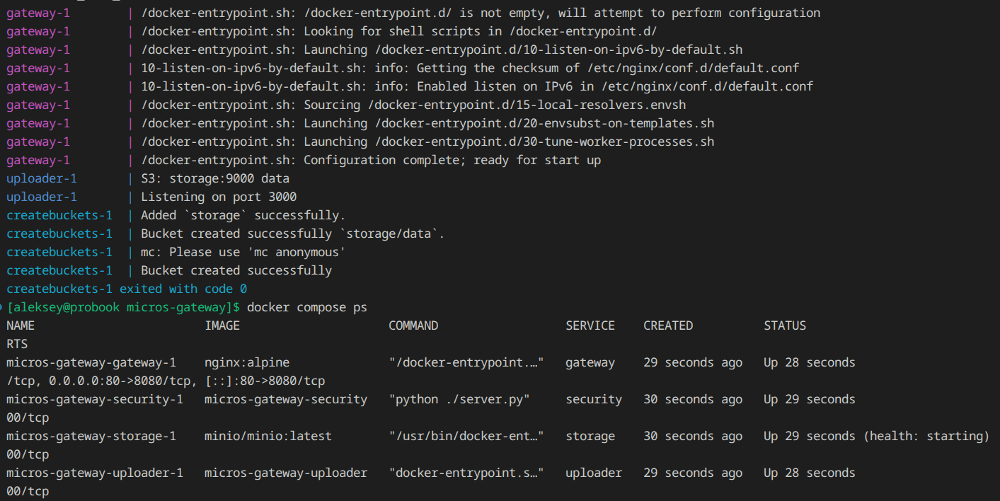
---
#### Получаем JWT токен
---
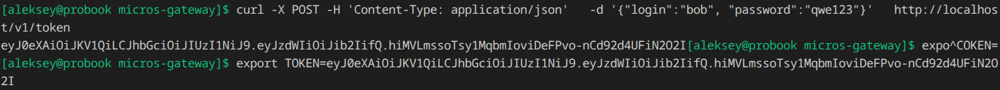
---
#### Загружаем картинку
---
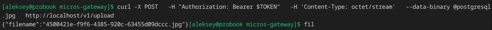
---
#### Скачиваем картинку
---
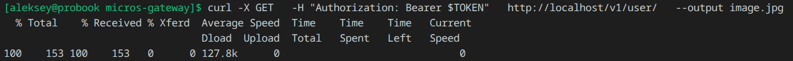
---
#### Проверка доступа
---
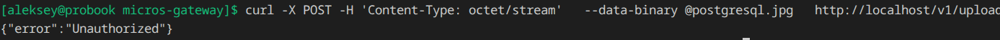
---
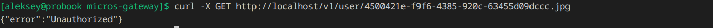
---
#### Итог работы API Gateway 
1. Маршрутизирует запросы:

    - POST /v1/token → security сервис

    - POST /v1/upload → uploader сервис (с проверкой токена)

    - GET /v1/user/{image} → MinIO (с проверкой токена)

2. Проверяет JWT токены через auth_request встроенным методом NGINX

3. Обеспечивает безопасность (запросы без токена получают 401)

4. Скрывает внутреннюю сложность — клиент не знает о существовании отдельных сервисов security, uploader, storage

## Домашнее задание к занятию «Микросервисы: подходы»

### Задача 1: Обеспечить инфраструктуру для разработки и эксплуатации в крупной компании, которая строит систему на основе микросервисной архитектуры

В качестве решения для обеспечения полного цикла разработки микросервисной архитектуры предлагается использование российской платформы **GitFlic**. GitFlic предоставляет «все в одном»: систему контроля версий Git, встроенный CI/CD, реестры артефактов и инструменты безопасной разработки.

**Обоснование выбора:** GitFlic входит в реестр отечественного ПО, что критически важно для компаний с государственным участием и субъектов КИИ. В отличие от связки GitHub + Jenkins или GitLab, GitFlic предлагает единую экосистему, которая не только закрывает все функциональные требования, но и обеспечивает безопасность на уровне ГОСТ, снижая риски и TCO.

#### Соответствие требованиям

| № | Требование | Реализация в GitFlic | Обоснование / Источник |
| :--- | :--- | :--- | :--- |
| **1** | Облачная система | Доступен как облачный SaaS, так и Self-Hosted версия. | Позволяет выбрать модель развертывания под требования безопасности компании . |
| **2** | Система контроля версий Git | Полноценный Git-сервер. | Базовая функциональность платформы для хранения исходного кода. |
| **3** | Репозиторий на каждый сервис | Поддержка неограниченного количества проектов. | Позволяет изолировать код каждого микросервиса в отдельном репозитории. |
| **4** | Запуск сборки по событию из VCS | Автоматический запуск пайплайнов по push, merge request, тегам и расписанию. | Стандартная функциональность CI/CD для автоматизации процессов . |
| **5** | Запуск сборки по кнопке с параметрами | Поддержка ручного запуска конвейеров (Manual). | Позволяет запускать сборку вручную, передавая переменные окружения. |
| **6** | Привязка настроек к каждой сборке | Конфигурация через файл `.gitflic-ci.yaml` в корне репозитория. | Возможность через переменные и окружения гибко управлять настройками под каждую сборку. |
| **7** | Шаблоны для различных конфигураций сборок | Переиспользование фрагментов конфигурации и компоненты для стандартизации этапов. | Значительно упрощает поддержку пайплайнов для десятков микросервисов . |
| **8** | Безопасное хранение секретов | Защищенные переменные и интеграция с HashiCorp Vault. | Секреты маскируются в логах, что исключает их утечку . |
| **9** | Несколько конфигураций из одного репозитория | Поддержка множества файлов `.gitflic-ci.yaml` или нескольких сценариев в одном файле. | Позволяет реализовать разные сценарии сборки для разных веток или задач. |
| **10** | Кастомные шаги при сборке | В секции `scripts` можно выполнять любые команды (Shell, batch). | Обеспечивает полную свободу настройки процесса сборки. |
| **11** | Собственные Docker-образы для сборки | Директива `image:`. | Позволяет запускать задачи в любом окружении (в т.ч. с сертификатами РФ) . |
| **12** | Развернуть агентов сборки на своих серверах | Self-hosted runners (агенты). | Ключевое требование. Агенты подключаются к мастер-серверу и работают в вашем контуре . |
| **13** | Параллельный запуск нескольких сборок | Мультизадачность агентов — один агент выполняет несколько задач одновременно. | Ускоряет процесс CI/CD для больших проектов . |
| **14** | Параллельный запуск тестов | Директива `parallel:` и матричные стратегии в пайплайнах. | Разбивает выполнение тестов на независимые части для экономии времени. |

#### Итоговая рекомендация

GitFlic полностью соответствует всем 14 техническим требованиям и превосходит OpenSource-решения в контексте российских реалий: он предлагает юридически значимую безопасность (сертификация, реестр), экономию на инфраструктуре (замена 3-4 продуктов одним) и технологическую независимость от западных вендоров. Для промышленной разработки микросервисной архитектуры это наиболее сбалансированное и перспективное решение.

### Задача 2: Обеспечение сбора и анализа логов сервисов в микросервисной архитектуре

Для сбора, хранения и анализа логов микросервисной архитектуры предлагается использовать стек **Grafana Loki**. Это современное OpenSource решение, специально спроектированное для облачных и контейнерных сред.

#### Архитектура и взаимодействие компонентов

Решение состоит из трёх программных продуктов:

| Компонент | Роль | Где запускается |
| :--- | :--- | :--- |
| **Promtail** | Агент сбора логов из stdout/stderr | На каждом хосте |
| **Grafana Loki** | Центральное хранилище логов | Кластер или один сервер |
| **Grafana** | Веб-интерфейс для поиска и визуализации | Отдельный сервис |

**Принцип работы:**

1. Микросервисы пишут логи в **stdout/stderr** — никаких изменений в коде не требуется.
2. **Promtail** на каждом хосте читает логи контейнеров, добавляет метки (имя сервиса, хост, namespace) и отправляет в Loki по HTTP.
3. **Loki** принимает логи, сжимает их и сохраняет в файловую систему или S3-совместимое хранилище.
4. **Grafana** подключается к Loki как к источнику данных и предоставляет веб-интерфейс для поиска, фильтрации и визуализации логов с помощью языка запросов LogQL.

#### Соответствие требованиям

| № | Требование | Как обеспечивается в решении |
| :--- | :--- | :--- |
| **1** | Сбор логов в центральное хранилище со всех хостов | Promtail запущен на каждом хосте и отправляет логи в единый кластер Loki |
| **2** | Минимальные требования к приложениям, сбор логов из stdout | Promtail читает стандартный вывод контейнеров (`docker logs`) — код приложения не меняется |
| **3** | Гарантированная доставка логов до центрального хранилища | Promtail буферизует логи на диске при недоступности Loki и повторяет отправку с экспоненциальной задержкой |
| **4** | Обеспечение поиска и фильтрации по записям логов | LogQL — язык запросов с фильтрацией по меткам, регулярным выражениям, поиском по тексту и JSON |
| **5** | Пользовательский интерфейс для доступа разработчиков | Grafana — веб-интерфейс с редактором LogQL, автодополнением и системой прав доступа |
| **6** | Возможность дать ссылку на сохранённый поиск | В Grafana: кнопка Share → копирование прямой ссылки на запрос или дашборд |

#### Вывод

Стек **Grafana Loki + Promtail + Grafana** полностью покрывает все требования задачи: централизованный сбор логов без доработки приложений, гарантированная доставка, мощный поиск через LogQL, удобный веб-интерфейс для разработчиков и возможность делиться ссылками на сохранённые запросы. Решение экономично, масштабируется и является современным стандартом для микросервисной observability.

### Задача 3: Обеспечение сбора и анализа состояния хостов и сервисов в микросервисной архитектуре

Для сбора и анализа метрик состояния хостов и сервисов предлагается использовать стек **Prometheus + Grafana** — промышленный стандарт мониторинга в микросервисной архитектуре.

#### Архитектура и взаимодействие компонентов

Решение состоит из четырёх компонентов:

| Компонент | Роль |
| :--- | :--- |
| **Node Exporter** | Сбор метрик хоста (CPU, RAM, диск, сеть) |
| **cAdvisor** | Сбор метрик потребления ресурсов каждым контейнером (сервисом) |
| **Клиентские библиотеки Prometheus** | Экспорт специфичных метрик из кода сервисов (число заказов, длительность запросов, ошибки) |
| **Prometheus** | Сбор, хранение и агрегация всех метрик (pull-модель) |
| **Grafana** | Визуализация, запросы, дашборды |

**Принцип работы:**

1. **Node Exporter** и **cAdvisor** запущены на каждом хосте и отдают метрики по HTTP.
2. **Микросервисы** с помощью клиентских библиотек экспортируют бизнес-метрики на `/metrics`.
3. **Prometheus** периодически опрашивает все эти эндпоинты и сохраняет данные.
4. **Grafana** подключается к Prometheus и позволяет через язык запросов **PromQL** строить графики и дашборды.

#### Соответствие требованиям

| Требование | Как обеспечивается |
| :--- | :--- |
| Сбор метрик со всех хостов | Prometheus опрашивает Node Exporter и cAdvisor на каждом хосте |
| Метрики ресурсов хостов (CPU, RAM, HDD, Network) | **Node Exporter** |
| Метрики потребления ресурсов на сервис | **cAdvisor** (метрики на контейнер) |
| Специфичные метрики сервиса | **Клиентские библиотеки Prometheus** в коде сервиса |
| UI для запросов и агрегации | **Grafana** + язык **PromQL** |
| UI для настраиваемых панелей | **Grafana Dashboards** |

#### Вывод

Стек **Prometheus + Grafana + Node Exporter + cAdvisor** полностью закрывает потребности мониторинга микросервисной архитектуры. Node Exporter собирает метрики хостов, cAdvisor — метрики контейнеров, клиентские библиотеки — бизнес-метрики. Prometheus агрегирует и хранит данные, Grafana предоставляет гибкий интерфейс для запросов и настройки дашбордов. Это зрелое, проверенное и масштабируемое решение, которое является отраслевым стандартом.

### Задача 4: Развертывание ситемы сбора журналов для микросервисов

Не получилось подобрать конфигурации vector к elasticsearch, потерял много времени на отладку.

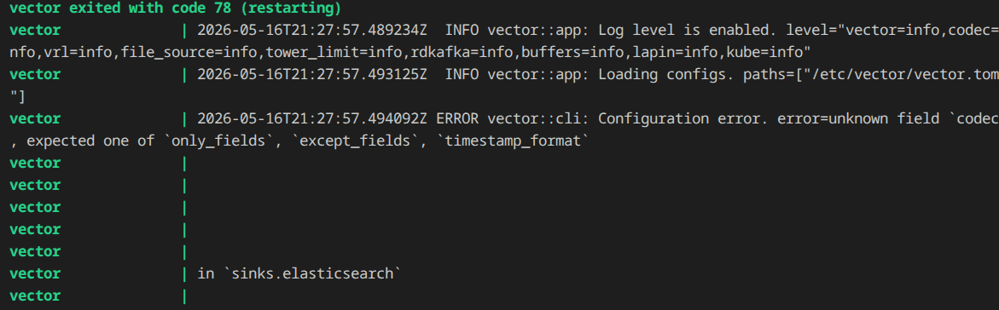

Решил использовать fluent-bit.

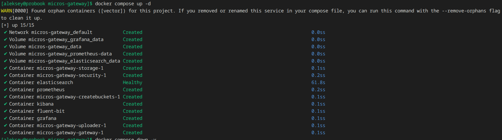

В kibana создал data view и в Discover применил фильтр: **log : "*Saved*"**

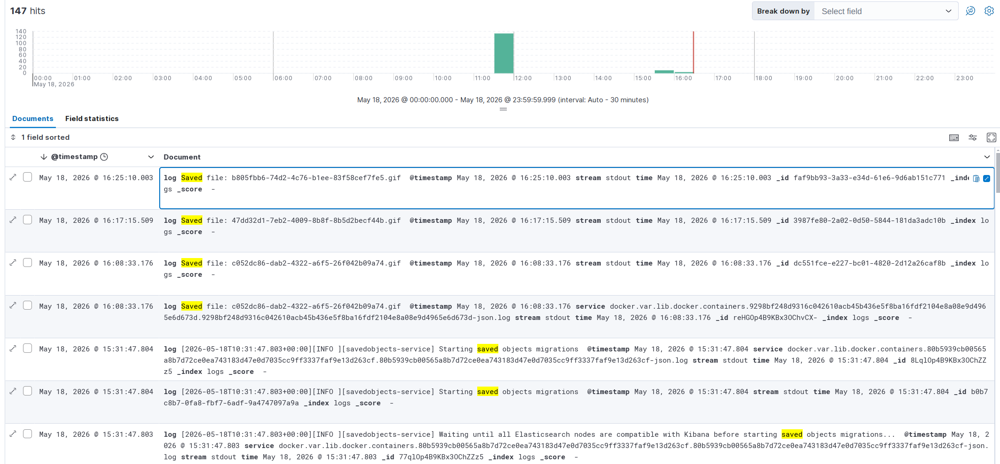

Отображаются 3 файла загруженные в хранилище s3 и события создания фйлов

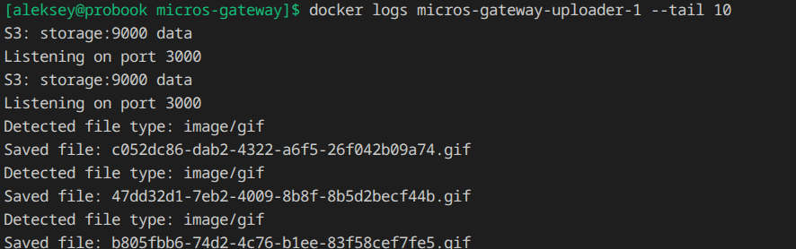

### Задача 5: Развертывание ситемы мониторинга для микросервисов

Настроены targets к экспортерам внутри контейнеров. prometheus-flask-exporter нет, поэтому метрик не видно.

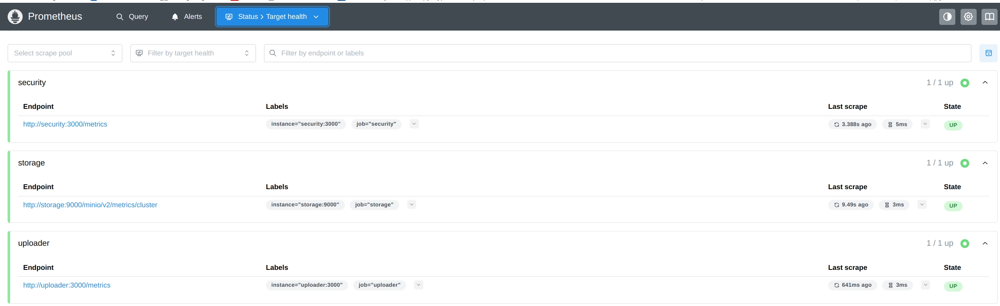

Настроил дашборд для отображения метрик по микросервисам.

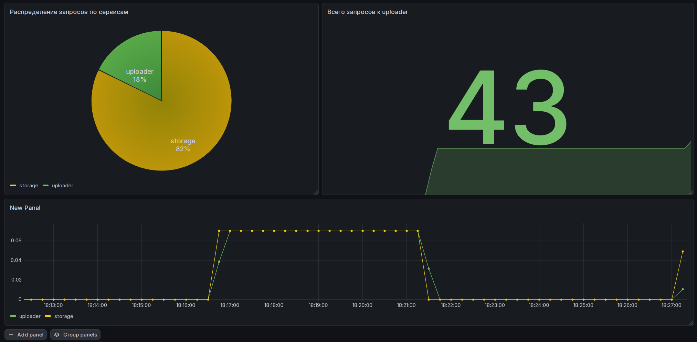

