# Мониторинг и логи


[Системы мониторинга](13._Системы_мониторинга.pdf)

[Средство визуализации Grafana](14._Средство_визуализации_Grafana.pdf)

[Система сбора логов Elastic Stack]()

[Платформа мониторинга Sentry]()

[Инцидент-менеджмент]()

## Домашнее задание к занятию "Системы мониторинга"

### 1. Для платформы с Web-интерфейсом, интенсивными вычислениями (нагрузка на CPU) и сохранением отчетов на диск, предлагаю следующий минимальный набор метрик:

* CPU usage (в процентах, отдельно user/system/iowait) — так как вычисления грузят ЦПУ если загружен на 100% — вычисления не успевают и висят в очереди.

* RAM usage (used, free, cached, available) — вычисления могут потреблять память так как ситема может уйти в swap.

* Disk usage (в процентах, inodes) — отчеты пишутся на диск, если диск заполнен отчеты не пишутся. Inodes важны, если много мелких файлов так как их количество конечно.

* Disk I/O (read/write bytes, iops) — интенсивная запись отчетов может упираться в диск.

* HTTP requests per second (RPS) — общая нагрузка на входе, поможет спрогнозировать когда необходимо масштабироваться.

* HTTP response codes (2xx, 4xx, 5xx) — здоровье приложения, понимать что web сервис отвечает.

* Number of generated reports (счетчик) - количество отчетов для руководства с целью планирования ресурсов

* Report generation time — сколько времени уходит на один отчет для рукодителя с целью установки SLI.

### 2. Менеджеру нужно говорить на языке SLA/SLI/SLO и сделать дашборд с бизнес-метриками:

* SLI (Service Level Indicator) — как измеряем качество:

    * Доступность сервиса: (время работы / общее время) * 100%

    * Успешность отчетов: (успешные ответы / всего ответы) * 100%

    * Задержка максимальная или минимальная: среднее время выполненния отчета в мс.

    * Интенсивность работы системы: максимальное количество отчетов сгенерированных за час (сутки).

    * Предсказание, когда закончится место: Свободное место на диске в днях.

* SLO (Service Level Objective) — цель, например, 99.9% успешных запросов.

* SLA (Service Level Agreement) — обязательства перед клиентами (штрафы, если SLO нарушен).

### 3. Решение — использовать бесплатные и встроенные инструменты:

* Системный лог (syslog/journald): Пусть приложения пишут ошибки в stderr. Systemd/journald соберет их бесплатно. Разработчики смогут смотреть через ssh journalctl -u сервис -f.

* Скрипт на bash или Python по cron сканирует логи приложений на слово «ERROR» и шлет на почту.

* Настроить syslog сервер (Syslog-ng) и указть его в настройках приложения, затем так же отправлять на почту или через API. Трудозатратный ,но с точки зрения масштабирования выгодный.

* Поднять бесплатные (open-source) инструменты мониторинга и сбора журналов например telegraf + InfluxDB + Chronograf, но нужно больше ресурсов и трудозатрат. Универсальное решение для всего в будущем.

### 4. Решение - откорректировать запросы
Я посмотрел статью [Список кодов состояния HTTP](https://ru.wikipedia.org/wiki/Список_кодов_состояния_HTTP) в которой приведена статистика о том ,что присутсвуют очень много ответов с кодом 304 Not Modified («не изменялось»). Сервер возвращает такой код, если клиент запросил документ методом GET, использовал заголовок If-Modified-Since или If-None-Match и документ не изменился с указанного момента. При этом сообщение сервера не должно содержать тела. Появился в HTTP/1.0.

* Считать успехом не только 2xx, но и 3xx (если редирект корректен): (summ_2xx + summ_3xx) / summ_all

* Либо исключить 3xx из знаменателя (если они не должны считаться в SLA): summ_2xx / (summ_all - summ_3xx)

* Либо проверять, не попали ли в summ_all ответы от балансировщика/healthcheck (они могут быть 200, но не отражают бизнес-логику).

### 5. Плюсы и минусы Pull и Push систем мониторинга:

* Pull

    * Плюсы: Легко обнаруживать сбои агентов (нет метрики — агент умер). Меньше риска перегрузки системы (контролируем частоту запросов).

    * Минусы: Нужен доступ к экспортерам из сервера мониторинга. Сложнее с высоконагруженными метриками (миллионы точек).

* Push

    * Плюсы: Подходит для краткосрочных задач (batch-джобы). Легче работать за NAT/firewall. Можно отправлять метрики из cron-скриптов.

    * Минусы: Сложно обнаружить, что клиент умер (если нет «heartbeat»). Риск переполнения очередей. Может потерять метрики при переполнении буфера.

### 6. Какие системы к какой модели относятся:

* Prometheus — Pull (основной), но есть Pushgateway для push-совместимости → гибрид.

* TICK (Telegraf + InfluxDB) — Push (Telegraf отправляет данные в InfluxDB).

* Zabbix — Push (агент сам отправляет данные серверу), но есть и pull (опрос SNMP, HTTP).

* VictoriaMetrics — Push (принимает через InfluxDB/Graphite протоколы) и Pull (может сам забирать с Prometheus endpoints) → гибрид.

* Nagios — Pull (сам проверяет сервисы через NRPE/SSH/check plugins).

### 7. Склонировал репозиторий, но запустить не удалось.

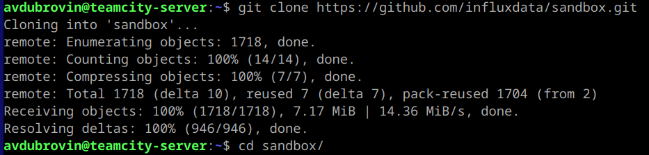

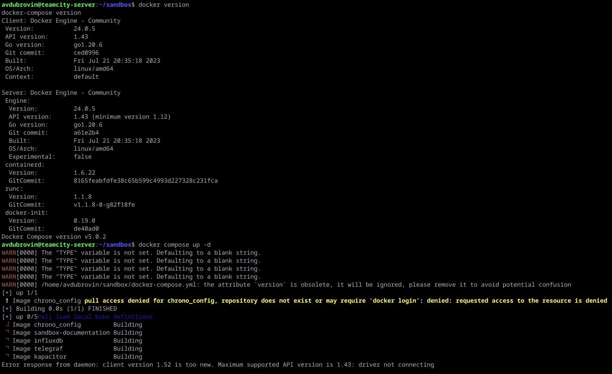

Оказалась не подходящая версия.
Посмотрел структуру docker файла и сделал на соответствующих образах.

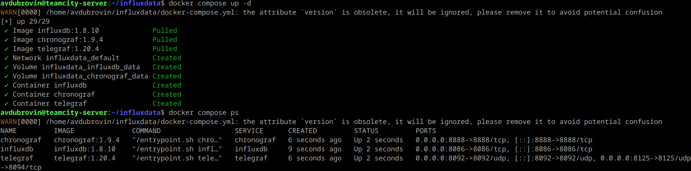

### 8. Создал dashboard с основными системными метриками.

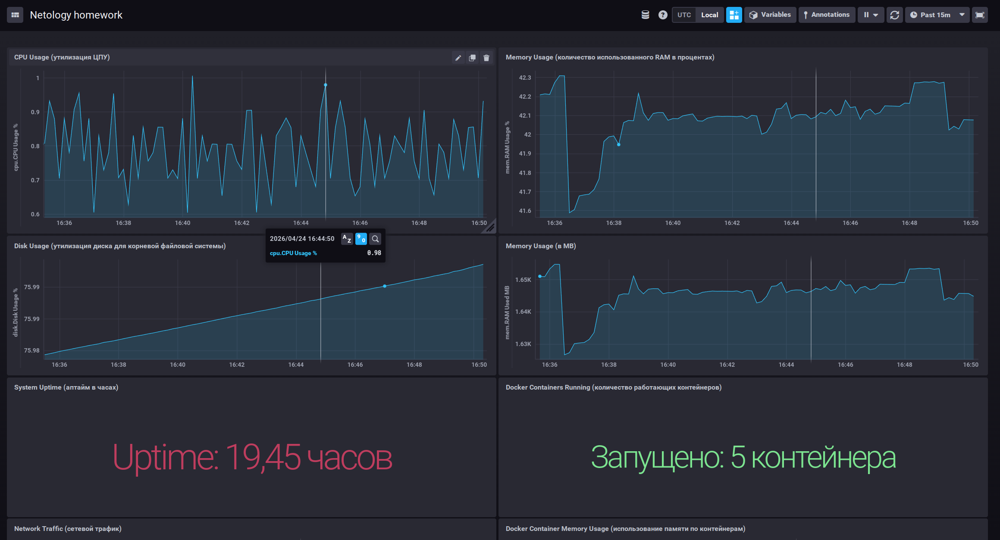

### 9. Подключил плагины: docker, docker_log и добавил запросы в dashboard.

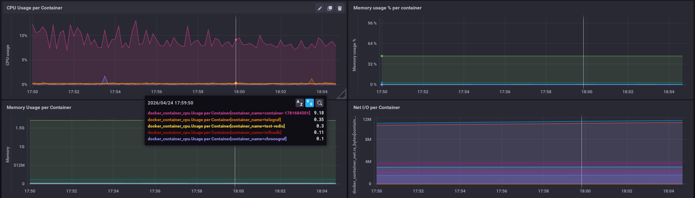

Дополнительно сделал запрос на отображение журнала с запущенных контейнеров.

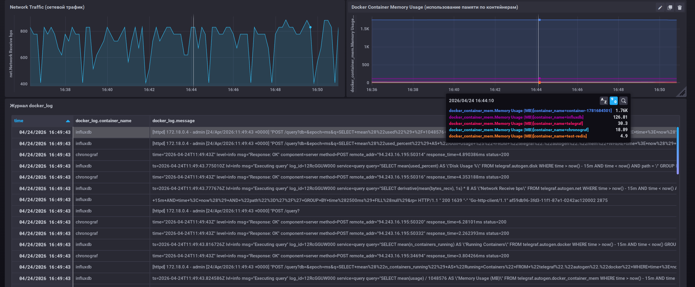

Ссылка на репозиторий с мониторингом: https://github.com/aleksey-dubrovin/tick-monitoring

---

## Домашнее задание к занятию «Средство визуализации Grafana»

[Introduction to PromQL, the Prometheus query language](IntroPromQ.html)

[PromQL tutorial for beginners and humans](PromQLtutorial.html)

[Understanding Machine CPU usage – Robust Perception](CPUusage.html)

### 1. Развернута система визуализации Grafana и добавлен источник Prometheus

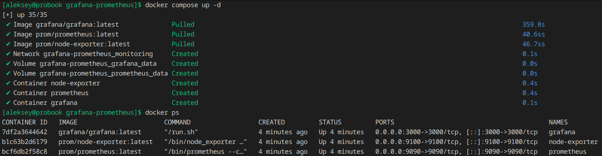

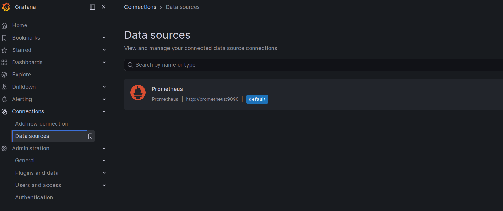

Источник, репозиторий: https://github.com/aleksey-dubrovin/grafana-prometheus

### 2. Созданный Dashboard с заданными панелями через promql-запросы

Утилизация CPU (в процентах)
```promql
    100 - (avg by (instance) (rate(node_cpu_seconds_total{mode="idle"}[5m])) * 100)

```

CPU Load Average (1, 5, 15 минут)
```promql
    LA 1 минута - node_load1
    LA 5 минут - node_load5
    LA 15 минут - node_load15
```

Количество свободной оперативной памяти
```
    node_memory_MemFree_bytes / 1024 / 1024
    node_memory_MemAvailable_bytes
```

Количество свободного места на файловой системе
```
    node_filesystem_avail_bytes{mountpoint="/", fstype!="tmpfs"} / 1024 / 1024 / 1024
```

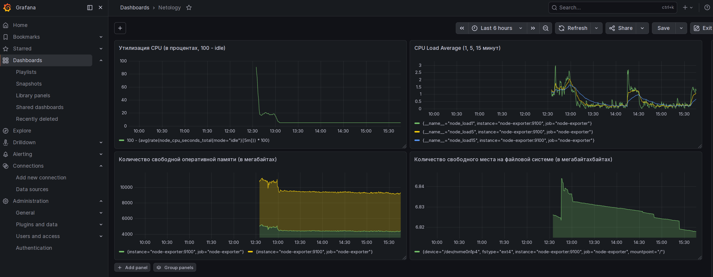

### 3. Создал чат-бот для уведомлений, настроил Contact point, Notifiaction Policy и Alert rules для dashboard

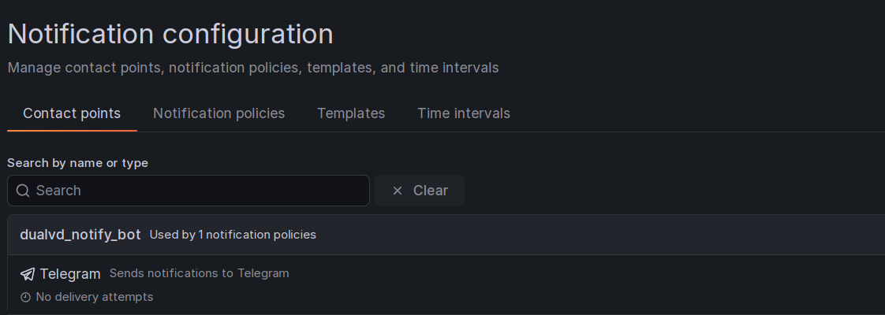

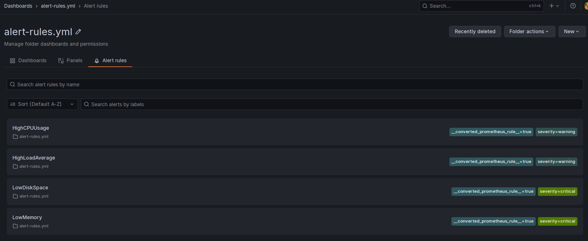

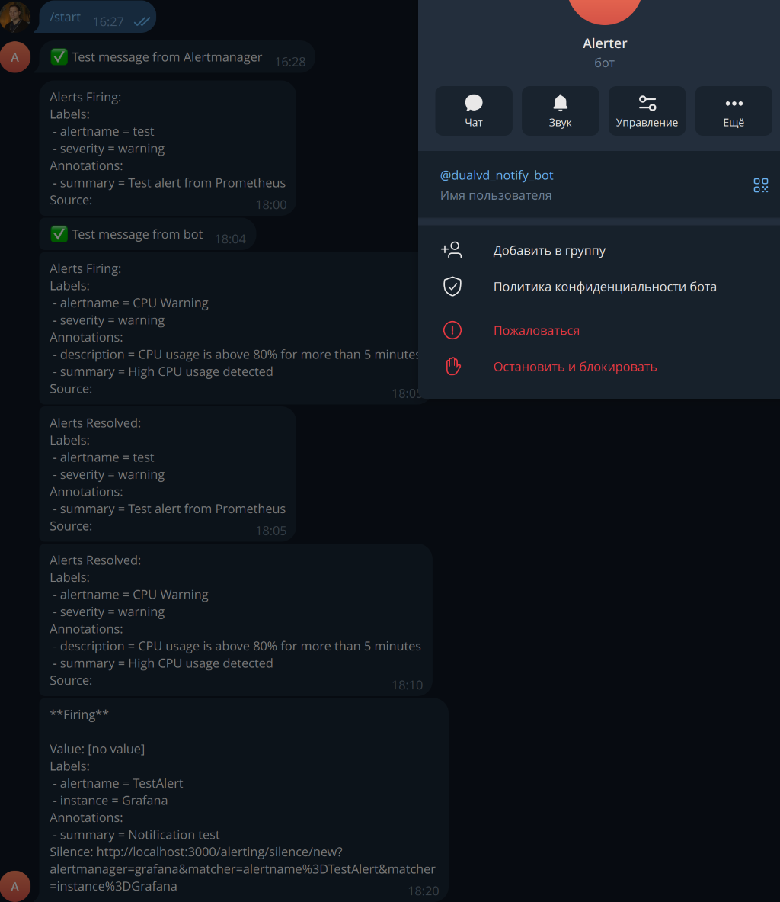

### 4. Выгрузил настроенный dashboard в репозиторий 
https://github.com/aleksey-dubrovin/grafana-prometheus/blob/main/dashboards/node-exporter-dashboard.json

---

## Домашнее задание к занятию «Система сбора логов Elastic Stack»

[Install Elasticsearch with Docker](Install_Elasticsearch_with_Docker.html)

[Sending Docker Logs to ElasticSearch and Kibana with FileBeat](Kibana_with_FileBeat.html)

[Creating a Logstash Pipeline](Logstash_Pipeline.html)

[Filter plugins](Logstash_Plugins.html)

[Config file format](Beats_Platform.html)

[Data views](Data_views.html)

[Discover](Discover.html)

[How to increase vm.max_map_count?](How_to_increase_vm.max_map_count.html)

### 1. Создание docker compose файла и развертывание компонентов в контейнерах

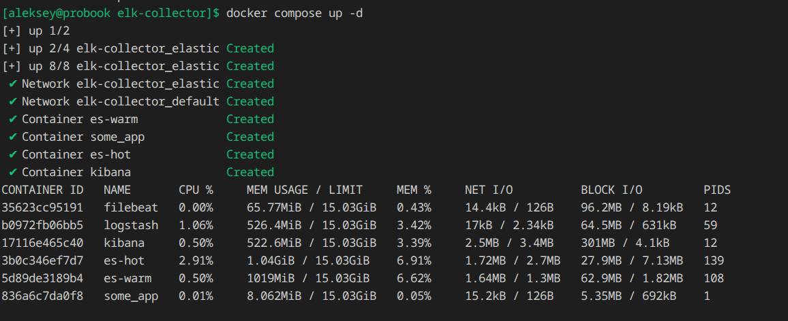

Статус кластера green

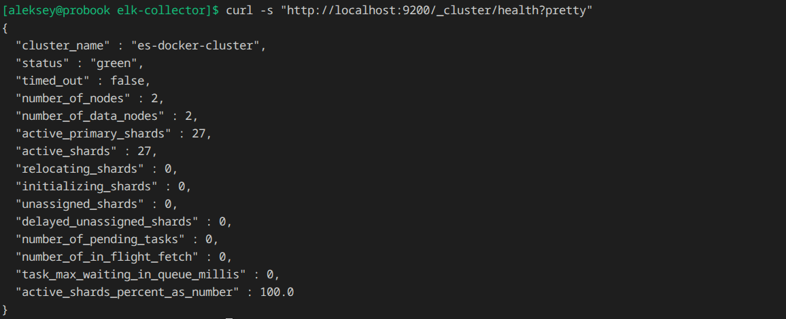

Интерфейс kibana

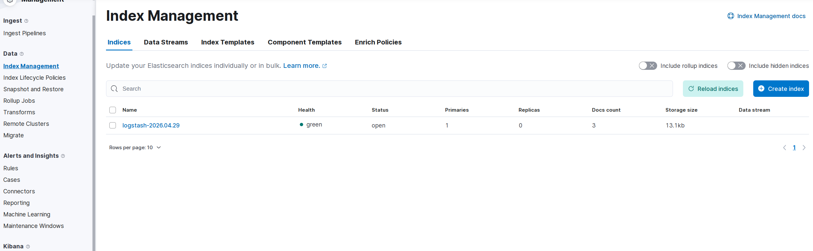

Рабочий репозиторий: https://github.com/aleksey-dubrovin/elk-collector.git

Пробовал сначала сам, но так индексы и не появились. Состояние клатсера было red. заработало только на single node конфигурации.

### 2. Добавил data view и попробовал искать по ключевым словам.

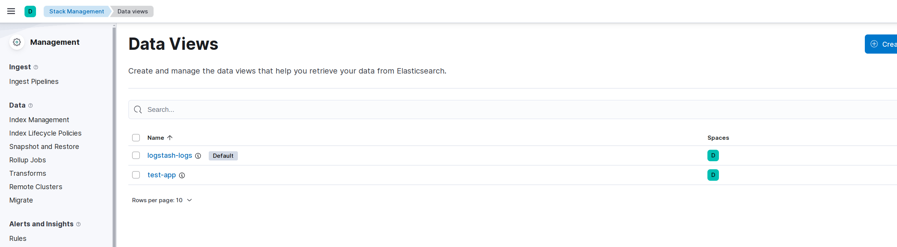

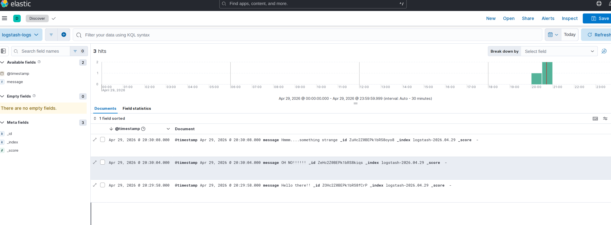

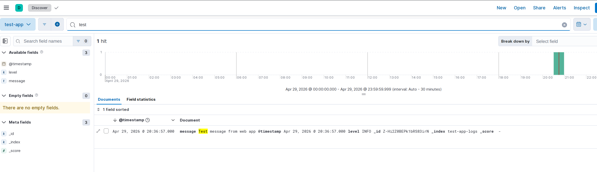

---