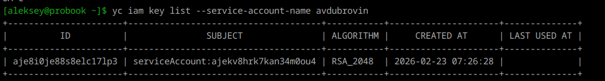
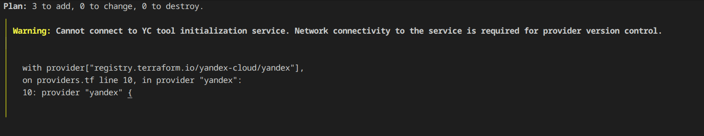
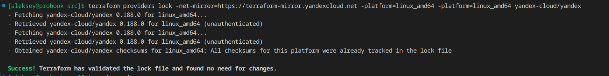
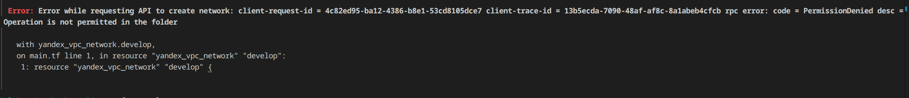
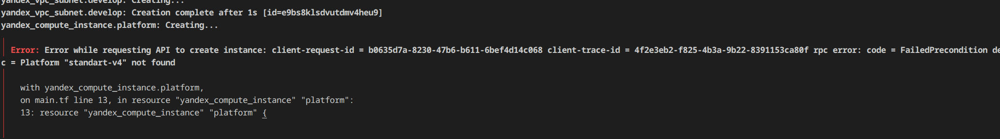
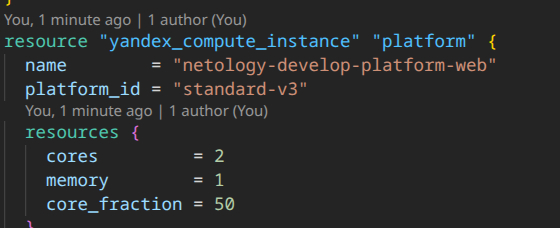
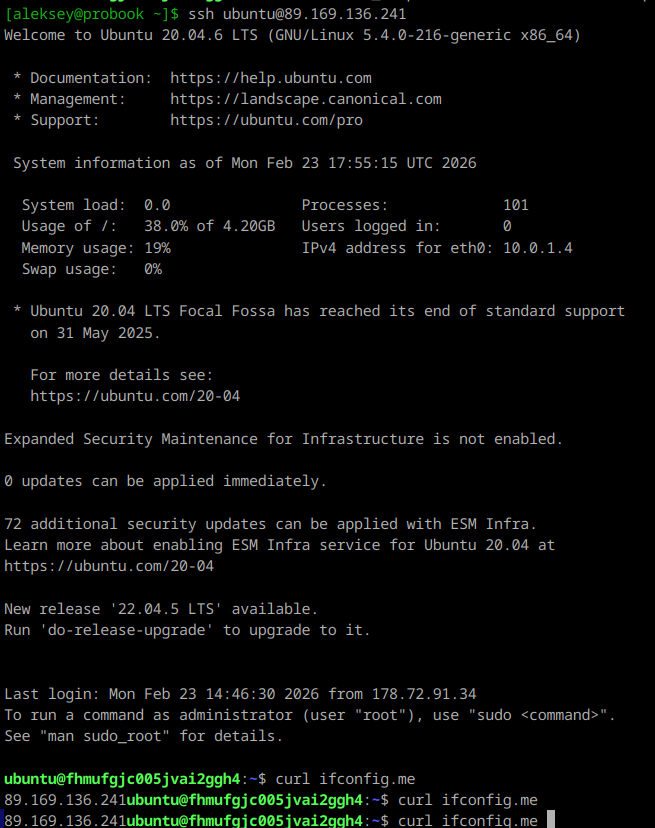
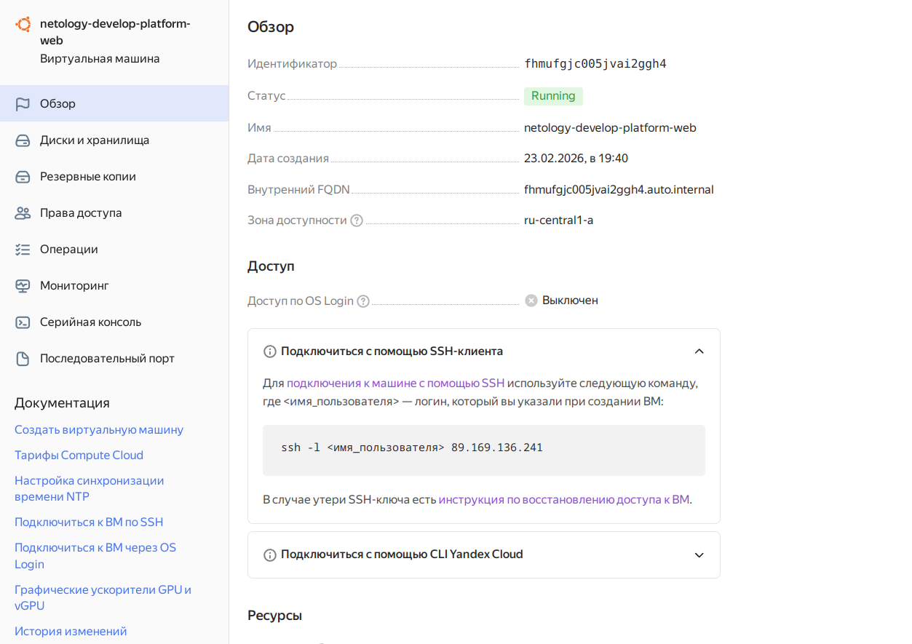

# Домашнее задание к занятию «Основы Terraform. Yandex Cloud»

## Задание 1







```bash
yc resource-manager folder add-access-binding b1glfq89j9n7quk0cnf0 --role admin --subject serviceAccount:ajekv8hrk7kan34m0ou4
```







* the specified number of cores is not available on platform "standard-v3"; allowed core number: 2, 4
* the specified core fraction is not available on platform "standard-v3"; allowed core fractions: 20, 50, 100
* Platform "standard-v4" not found



