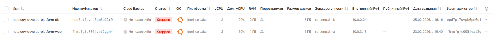
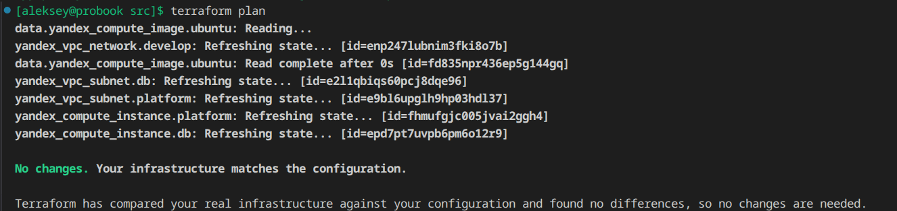
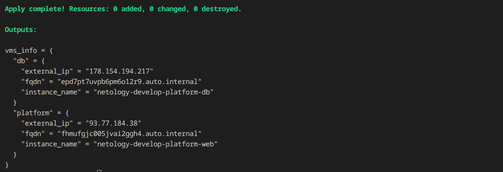
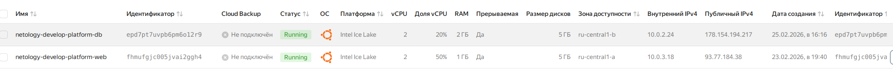
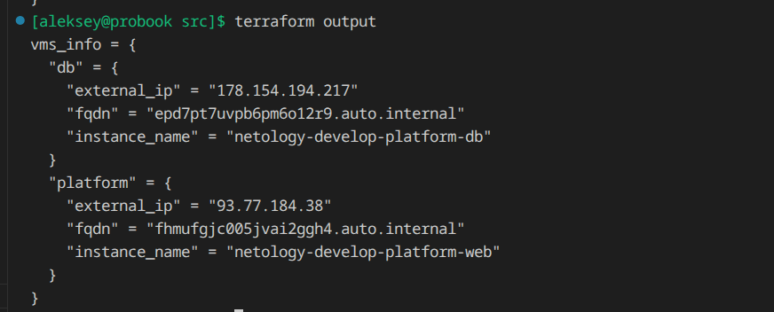
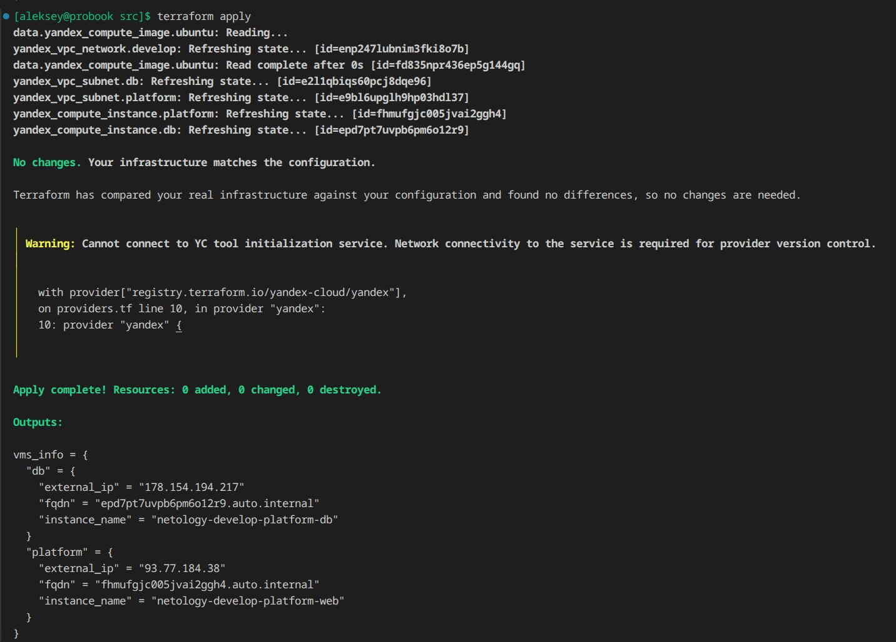
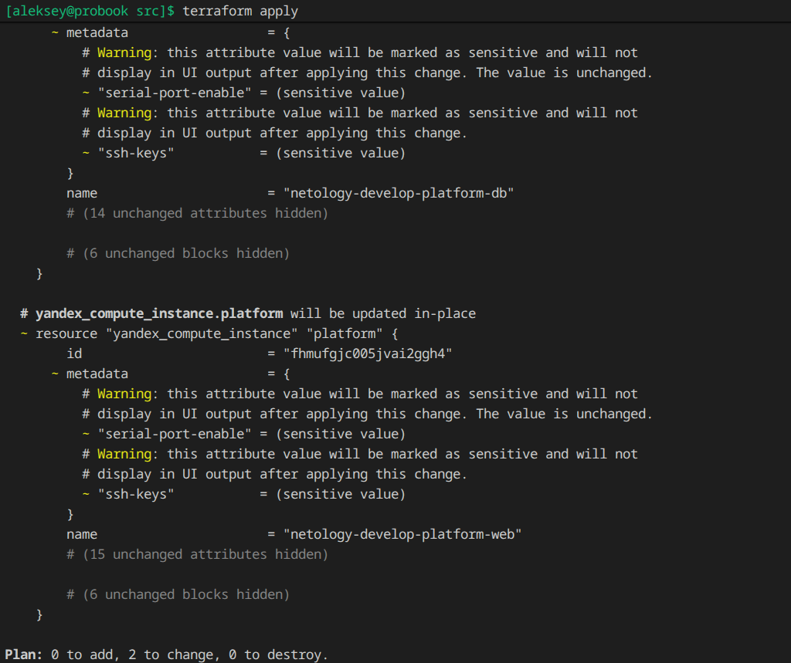

# Домашнее задание к занятию «Основы Terraform. Yandex Cloud»

## Задание 1


```bash
yc resource-manager folder add-access-binding b1glfq89j9n7quk0cnf0 --role admin --subject serviceAccount:ajekv8hrk7kan34m0ou4
```


**Исправлено название профиля standard-v4, так как было указано не верно. А так же было принято решение использовать профиль standard-v3, так как v4 не найден.**  
* Platform "standard-v4" not found


**Были найдены и исправлены следующие ошибки:**

* the specified number of cores is not available on platform "standard-v3"; allowed core number: 2, 4
* the specified core fraction is not available on platform "standard-v3"; allowed core fractions: 20, 50, 100


**Параметры использования ресурсов , в частности preemptible = true (прерываемость) и core_fraction=5 (гарантируема доля использования CPU) позволяют сэкономить бюджет на этапе развертывания и отладки, без изменения архитектуры ВМ.**

## Задание 2


## Задание 3





## Задание 4







## Задание 5



## Задание 6



## Дополнительное задание (со звёздочкой*)