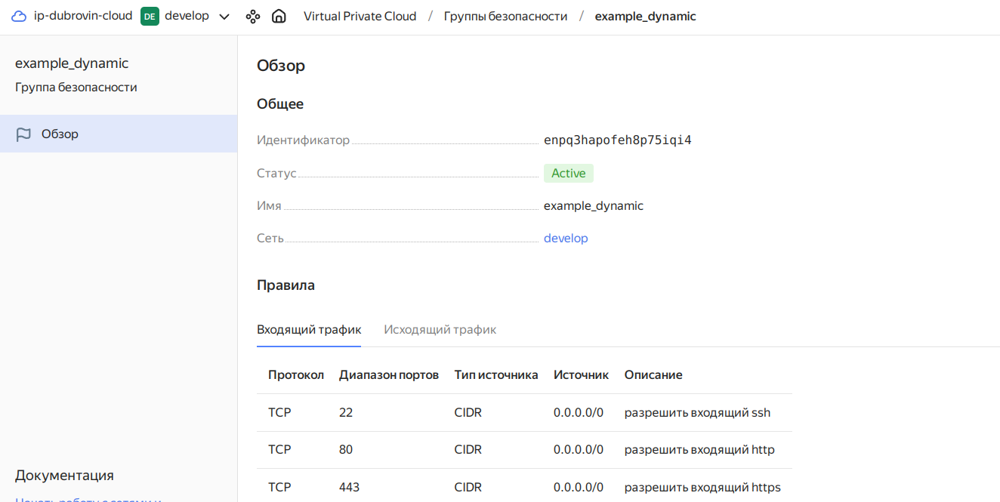
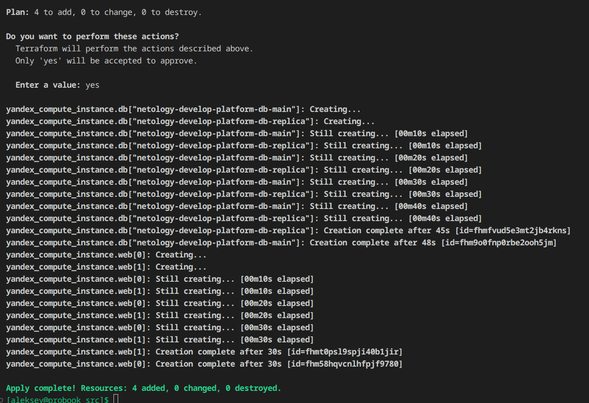
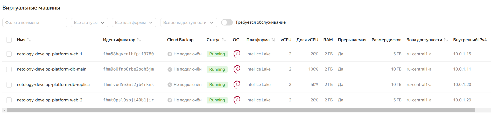
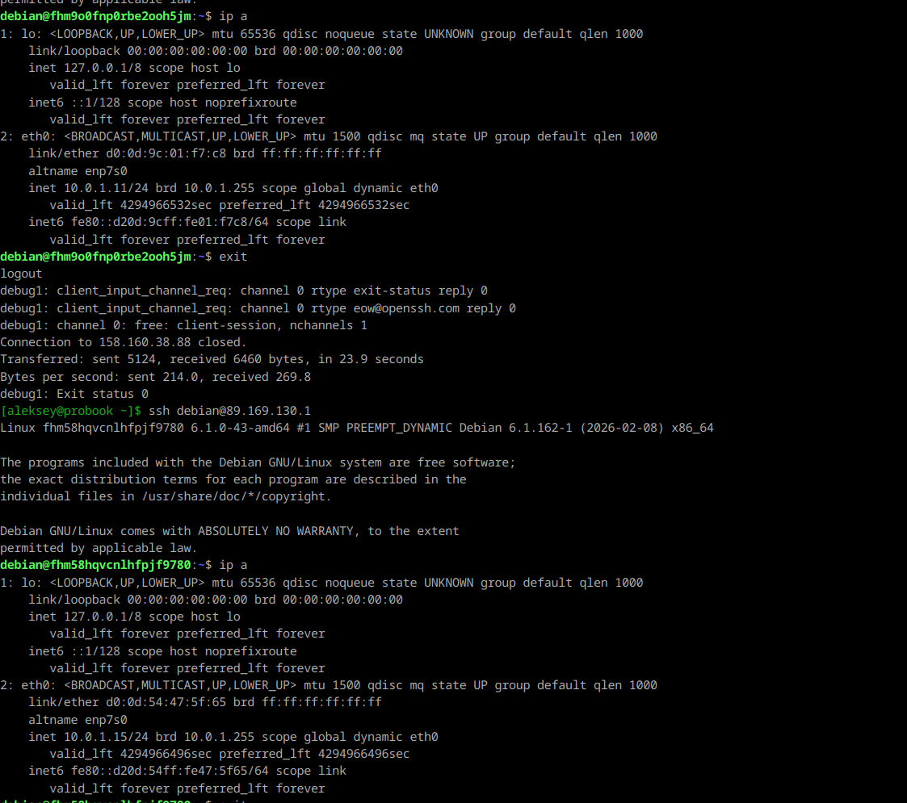
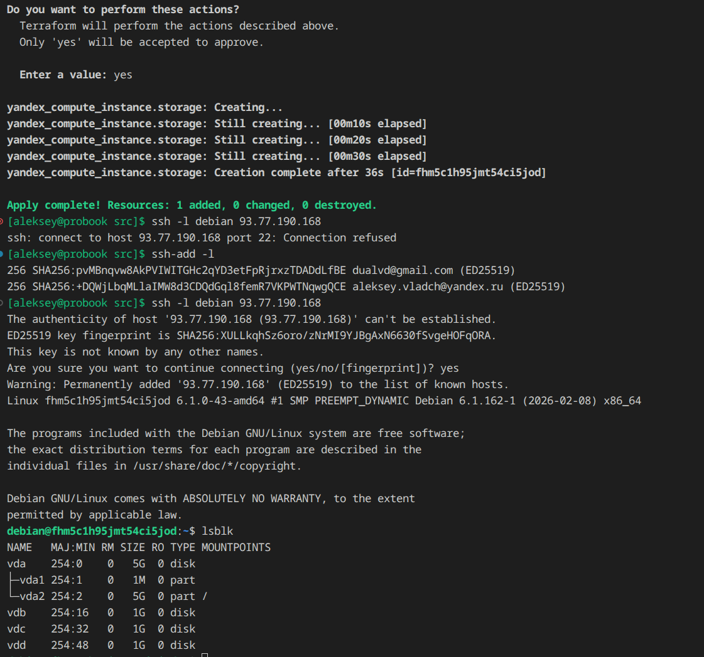
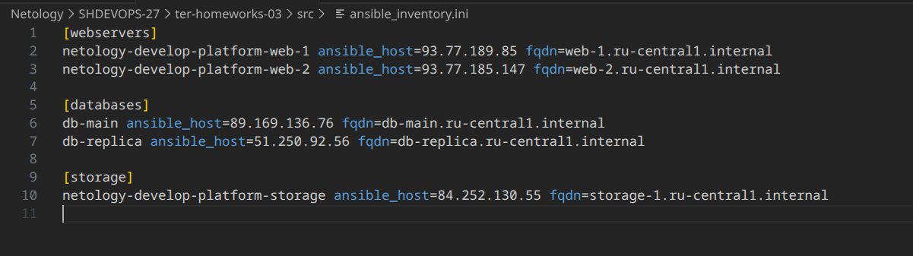

# Домашнее задание к занятию «Управляющие конструкции в коде Terraform»

## Цели задания

1. Отработать основные принципы и методы работы с управляющими конструкциями Terraform.
2. Освоить работу с шаблонизатором Terraform (Interpolation Syntax).

## Задание 1

## Задание 2

## Задание 3

## Задание 4

## Дополнительные задания (со звездочкой*)