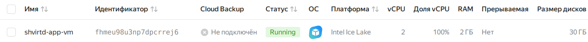
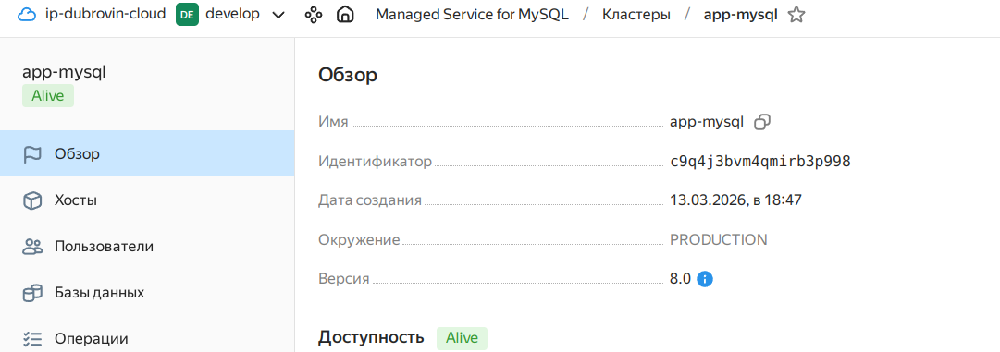
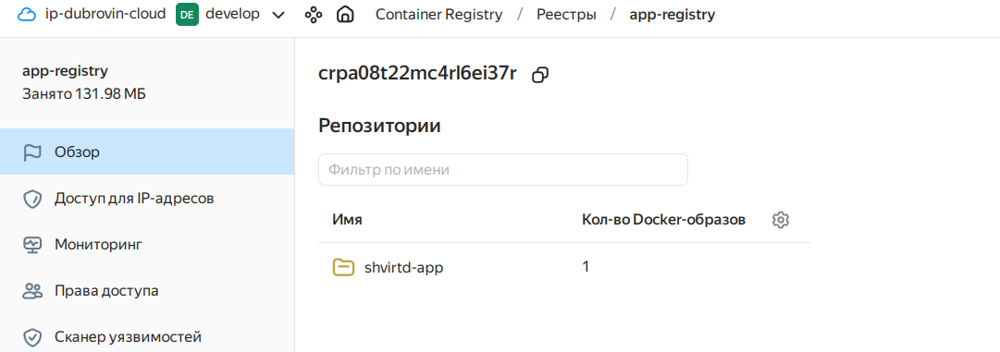
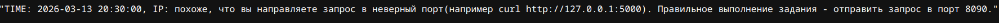
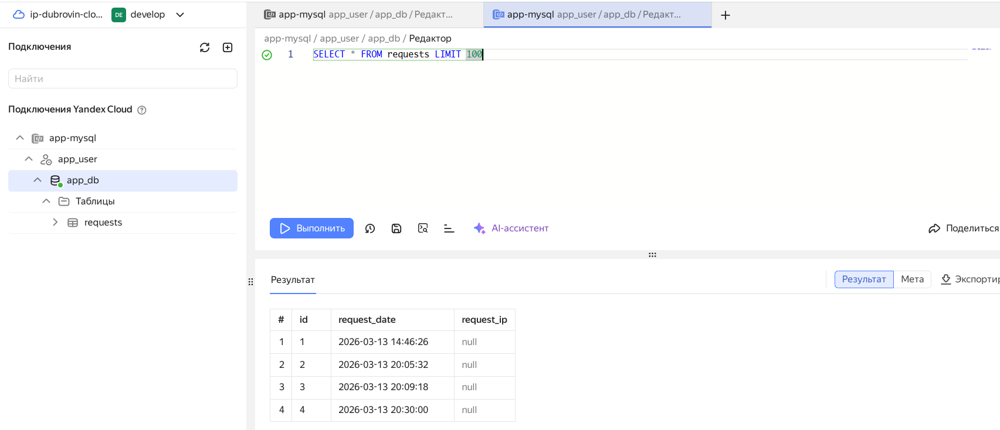
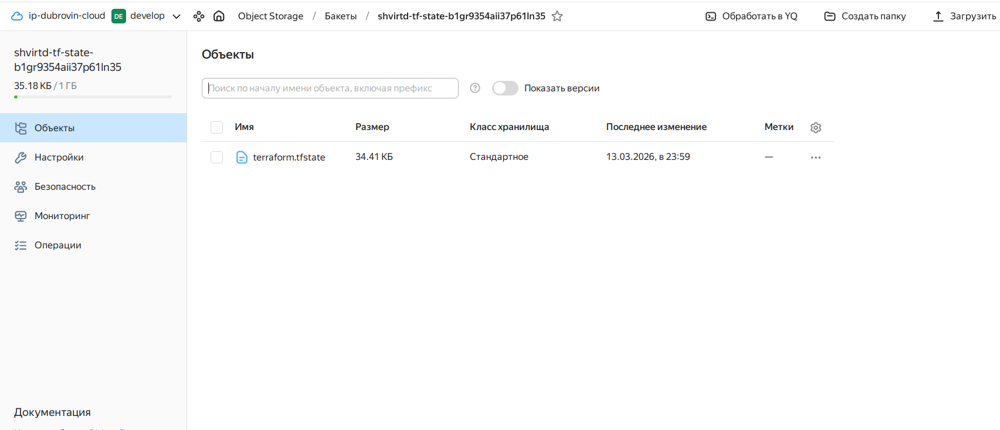

Отлично! Вот сжатая версия README.md, где конфиги описаны кратко, с отсылкой к файлам в репозитории:

# Итоговый проект: Развертывание web-приложения в Yandex Cloud

## 📋 Содержание
- [Описание проекта](#описание-проекта)
- [Выполнение требований](#выполнение-требований)
- [Архитектура](#архитектура)
- [Структура репозитория](#структура-репозитория)
- [Быстрый старт](#быстрый-старт)
- [Детали реализации](#детали-реализации)
- [Проверка](#проверка)
- [Скриншоты](#скриншоты)

## 🎯 Описание проекта
Развертывание FastAPI приложения в Yandex Cloud с использованием Terraform, Docker и Managed MySQL в рамках итогового проекта.

## ✅ Выполнение требований

| Задание | Реализация | Файлы |
|---------|------------|-------|
| **1. Инфраструктура** | VPC, подсети, ВМ, группы безопасности (22,80,443), Managed MySQL, Container Registry | `network.tf`, `security.tf`, `vms.tf`, `mysql.tf`, `registry.tf` |
| **2. Docker + Compose** | Установка через cloud-init | `files/cloud-init.yaml` |
| **3. Dockerfile** | Мультисборка, образ в Registry | `Dockerfile` |
| **4. Интеграция с БД** | Переменные окружения в контейнере | `vms.tf` (user-data) |
| **5*. LockBox** | Хранение пароля БД | `lockbox.tf` |
| **Чек-лист** | Без хардкода, удаленный state (S3), блокировки, доступ по IP | `backend.tf`, `variables.tf` |

## 🏗 Архитектура
```
Интернет → ВМ (Ubuntu 22.04, порт 80) → Docker контейнер (порт 5000) → Managed MySQL
                              ↳ Container Registry для образа
                              ↳ LockBox для пароля БД
                              ↳ S3 bucket для Terraform state
```

## 📁 Структура репозитория
```
terraform/
├── main.tf                 # Провайдер
├── variables.tf            # Переменные (без хардкода)
├── outputs.tf              # Выходные данные: IP, ID ресурсов
├── backend.tf              # S3 бэкенд с блокировками
├── network.tf              # VPC и подсеть 192.168.72.0/24
├── security.tf             # Группы безопасности (порты 22,80,443)
├── mysql.tf                # Managed MySQL кластер
├── registry.tf             # Container Registry
├── lockbox.tf              # LockBox секрет для пароля БД
├── vms.tf                  # ВМ с cloud-init и привязкой групп
├── storage.tf              # S3 bucket для state
├── files/
│   └── cloud-init.yaml     # Установка Docker и Docker Compose
└── Dockerfile              # Мультисборка приложения
```

## 🚀 Быстрый старт

### Предварительные шаги
```bash
# 1. Клонирование
git clone <repo>
cd terraform

# 2. Настройка переменных
cp terraform.tfvars.example terraform.tfvars
# Отредактируйте файл с вашими данными

# 3. Создание и загрузка Docker образа
REGISTRY_ID=$(terraform output -raw container_registry_id)
docker build -t cr.yandex/${REGISTRY_ID}/shvirtd-app:latest .
docker push cr.yandex/${REGISTRY_ID}/shvirtd-app:latest
```

### Развертывание
```bash
# Инициализация (с локальным state)
terraform init

# Создание инфраструктуры
terraform apply -auto-approve

# Настройка удаленного state (после создания бакета)
terraform init -migrate-state -backend-config=backend-prod.hcl
```

### Получение доступа
```bash
VM_IP=$(terraform output -raw vm_public_ip)
echo "http://${VM_IP}"
```

## 🔧 Детали реализации

### Задание 1: Инфраструктура ([network.tf](terraform/network.tf), [security.tf](terraform/security.tf), [vms.tf](terraform/vms.tf), [mysql.tf](terraform/mysql.tf), [registry.tf](terraform/registry.tf))
- VPC `app-network` с подсетью `192.168.72.0/24`
- Группа безопасности с правилами для портов 22, 80, 443
- ВМ с Ubuntu 22.04 (2 ядра, 2 GB RAM)
- Managed MySQL кластер (s2.micro, 10 GB)
- Container Registry для хранения образа

### Задание 2: Установка Docker ([files/cloud-init.yaml](terraform/files/cloud-init.yaml))
```yaml
# Установка Docker и Docker Compose через официальные скрипты
- curl -fsSL https://get.docker.com | sh
- curl -L "https://github.com/docker/compose/releases/latest/download/docker-compose-$(uname -s)-$(uname -m)" -o /usr/local/bin/docker-compose
```

### Задание 3: Dockerfile ([Dockerfile](terraform/Dockerfile))
```dockerfile
# Мультисборка: этап сборки зависимостей и финальный образ
FROM python:3.11-slim AS builder
...
FROM python:3.11-slim
COPY --from=builder /root/.local /root/.local
...
```

### Задание 4: Интеграция с БД ([vms.tf](terraform/vms.tf))
Переменные окружения передаются в контейнер через docker run:
```bash
docker run -e DB_HOST=${mysql_host} -e DB_USER=${db_user} -e DB_PASSWORD=${db_password} ...
```

### Задание 5*: LockBox ([lockbox.tf](terraform/lockbox.tf))
```hcl
# Секрет с паролем БД и права для сервисного аккаунта
resource "yandex_lockbox_secret" "db_secret" { ... }
resource "yandex_lockbox_secret_iam_binding" "vm_reader" { ... }
```

### Удаленный state ([backend.tf](terraform/backend.tf))
```hcl
terraform {
  backend "s3" {
    endpoint = "storage.yandexcloud.net"
    bucket   = "shvirtd-terraform-state-${var.yc_folder_id}"
    key      = "shvirtd/terraform.tfstate"
    region   = "ru-central1"
    # Поддержка блокировок через DynamoDB (аналог в YC - YDB)
  }
}
```

## 🔍 Проверка

### Локально
```bash
# Проверка доступности
curl http://$(terraform output -raw vm_public_ip)
# Ожидаемый ответ: "TIME: ..., IP: ..."

# Просмотр записей в БД
curl http://$(terraform output -raw vm_public_ip)/requests
```

### На ВМ
```bash
ssh ubuntu@$(terraform output -raw vm_public_ip)

# Проверка Docker
sudo docker ps
sudo docker logs shvirtd-app

# Проверка cloud-init
sudo cat /var/log/cloud-init-output.log | grep -A 10 "runcmd"
```

## 📸 Скриншоты

### 1. Созданные ресурсы в Yandex Cloud







### 2. Работающее приложение



### 3. Записи в БД



### 4. Удаленный state в S3



## 🧹 Очистка
```bash
terraform destroy -auto-approve
yc storage bucket delete --name shvirtd-terraform-state-${YC_FOLDER_ID}
```

## 📚 Полезные ссылки
- [Документация Yandex Cloud](https://cloud.yandex.ru/docs)
- [Terraform провайдер Yandex Cloud](https://registry.terraform.io/providers/yandex-cloud/yandex/latest/docs)
- [Container Optimized Image](https://cloud.yandex.ru/docs/cos/)

---

**Автор**: Алексей Дубровин
**Дата**: Март 2026
**Версия**: 1.0.0