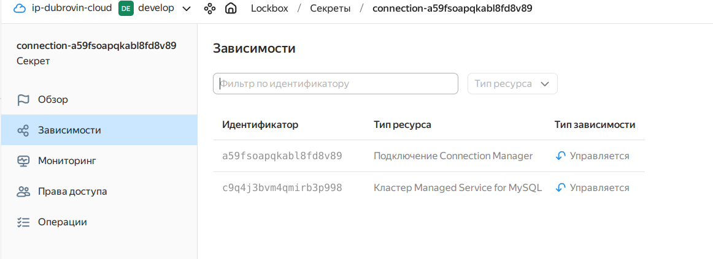

# Итоговый проект: Развертывание web-приложения в Yandex Cloud

## 📋 Содержание
- [Описание проекта](#описание-проекта)
- [Выполнение требований](#выполнение-требований)
- [Архитектура](#архитектура)
- [Структура репозитория](#структура-репозитория)
- [Предварительные требования](#предварительные-требования)
- [Быстрый старт](#быстрый-старт)
- [Детали реализации](#детали-реализации)
- [Проверка работы](#проверка-работы)
- [Устранение неполадок](#устранение-неполадок)
- [Очистка ресурсов](#очистка-ресурсов)
- [Скриншоты](#скриншоты)

## 🎯 Описание проекта
Развертывание FastAPI приложения в Yandex Cloud с использованием Terraform, Container Optimized Image (COI) и Managed MySQL. Приложение сохраняет информацию о запросах (время и IP) в базу данных.

## ✅ Выполнение требований

| Задание | Реализация | Файлы |
|---------|------------|-------|
| **1. Инфраструктура** | VPC (существующая), подсеть, ВМ с COI, группы безопасности (22,80,443,5000), Managed MySQL, Container Registry | `network.tf`, `security.tf`, `vms.tf`, `mysql.tf`, `registry.tf` |
| **2. Docker + Compose** | Установка через Container Optimized Image (COI) | `vms.tf` + COI образ |
| **3. Dockerfile** | Мультисборка, образ в Registry | `Dockerfile` (в корне) |
| **4. Интеграция с БД** | Переменные окружения в `declaration.yaml` | `declaration.yaml` |
| **5*. LockBox** | Хранение пароля БД | `lockbox.tf` |
| **Чек-лист** | Без хардкода, удаленный state (S3 с блокировками через `use_lockfile`), доступ по IP | `backend.tf`, `variables.tf` |

## 🏗 Архитектура
```
Интернет → ВМ (Container Optimized Image, порт 80) → Docker контейнер (порт 5000) → Managed MySQL
                              ↳ Container Registry
                              ↳ LockBox для пароля БД
                              ↳ S3 bucket для Terraform state
```

## 📁 Структура репозитория

### Корневые файлы конфигурации
| Файл | Назначение |
|------|------------|
| `main.tf` | Провайдер Yandex Cloud и настройки Terraform |
| `variables.tf` | Входные переменные (токены, ключи, пароли) |
| `outputs.tf` | Выходные данные: IP ВМ, адрес MySQL, ID Registry |
| `backend.tf` | S3 бэкенд для удаленного хранения state с блокировками |

### Сеть и безопасность
| Файл | Назначение |
|------|------------|
| `network.tf` | Подключение к существующей VPC "develop", создание подсети `192.168.172.0/24` |
| `security.tf` | Группы безопасности для ВМ (порты 22,80,443,5000) и MySQL (доступ только из ВМ) |

### Вычислительные ресурсы
| Файл | Назначение |
|------|------------|
| `vms.tf` | ВМ с Container Optimized Image, привязка групп безопасности, метаданные |
| `registry.tf` | Container Registry для хранения Docker образа |

### База данных
| Файл | Назначение |
|------|------------|
| `mysql.tf` | Managed MySQL кластер, база данных `app_db`, пользователь `app_user` |

### Безопасность и секреты
| Файл | Назначение |
|------|------------|
| `lockbox.tf` | LockBox секрет с паролем БД, права доступа для сервисного аккаунта |
| `service-account-data.tf` | Данные существующего сервисного аккаунта |

### Хранение state
| Файл | Назначение |
|------|------------|
| `storage.tf` | S3 bucket для Terraform state с версионированием |

### Конфигурационные файлы
| Файл | Назначение |
|------|------------|
| `declaration.yaml` | Спецификация контейнера для COI (образ, порты, переменные окружения) |
| `cloud_config.yaml` | Cloud-init конфигурация (пользователь yc-user, SSH ключ) |
| `.terraform.lock.hcl` | Зафиксированные версии провайдеров |

## 📋 Предварительные требования

### Необходимые инструменты
```bash
# Terraform >= 1.6 (для use_lockfile в S3 бэкенде)
terraform --version

# Yandex Cloud CLI
yc --version
yc init
```

### Необходимые ресурсы в Yandex Cloud
1. **Платежный аккаунт**
2. **Существующая VPC** с именем `develop` (указана в `network.tf`)
3. **Сервисный аккаунт** (в проекте используется `avdubrovin-dev` с ID `ajeogmb8jb2p8j0gpsia`)
4. **Статические ключи доступа** для S3 (указаны в `~/.aws/credentials`)

### Переменные окружения
```bash
export YC_TOKEN=$(yc iam create-token)
export YC_CLOUD_ID=$(yc config get cloud-id)
export YC_FOLDER_ID=$(yc config get folder-id)
```

## 🚀 Быстрый старт

### 1. Клонирование и настройка
```bash
git clone <your-repository-url>
cd terraform

# Создание файла с переменными
cp terraform.tfvars.example terraform.tfvars
# Отредактируйте файл с вашими данными
```

### 2. Создание инфраструктуры
```bash
# Инициализация (с локальным state)
terraform init

# Просмотр планируемых изменений
terraform plan

# Создание инфраструктуры
terraform apply -auto-approve
```

### 3. Сборка и загрузка Docker образа
```bash
# Получение ID реестра
REGISTRY_ID=$(terraform output -raw container_registry_id)

# Аутентификация в Container Registry
yc container registry configure-docker

# Сборка образа (из корня проекта, где лежит Dockerfile)
cd ..
docker build -t cr.yandex/${REGISTRY_ID}/shvirtd-app:latest .
cd terraform

# Загрузка образа
docker push cr.yandex/${REGISTRY_ID}/shvirtd-app:latest
```

### 4. Настройка удаленного state
```bash
# После создания бакета переносим state
terraform init -migrate-state
```

## 🔧 Детали реализации

### Задание 1: Инфраструктура
- **VPC и подсеть**: используется существующая сеть `develop`, создается подсеть `192.168.172.0/24` (`network.tf`)
- **Группы безопасности**: открыты порты 22, 80, 443, 5000 для ВМ; MySQL доступен только из группы ВМ (`security.tf`)
- **Виртуальная машина**: Container Optimized Image, 2 ядра, 2 GB RAM (`vms.tf`)
- **Managed MySQL**: кластер MySQL 8.0, s2.micro, 10 GB (`mysql.tf`)
- **Container Registry**: реестр для хранения Docker образа (`registry.tf`)

### Задание 2: Docker через COI
Вместо ручной установки Docker используется **Container Optimized Image** от Yandex Cloud, который уже содержит предустановленный Docker. Спецификация контейнера задается через `docker-container-declaration` в метаданных ВМ.

### Задание 3: Dockerfile с мультисборкой
В корне проекта находится `Dockerfile` с двухэтапной сборкой:
- **Этап 1 (builder)**: установка зависимостей Python
- **Этап 2 (final)**: копирование только необходимых файлов

### Задание 4: Интеграция с БД
В `declaration.yaml` передаются переменные окружения для подключения к Managed MySQL:
- `DB_HOST`, `DB_USER`, `DB_PASSWORD`, `DB_NAME`, `DB_PORT`

### Задание 5*: LockBox для паролей
`lockbox.tf` создает секрет с тремя ключами:
- `db_password`, `db_user`, `db_name`

Сервисному аккаунту выдаются права на чтение секрета.

### Удаленный state с блокировками
`backend.tf` использует S3 с параметром `use_lockfile` (доступно в Terraform >=1.6), что обеспечивает блокировки без отдельной базы данных.

## 🔍 Проверка работы

### Получение информации
```bash
terraform output
VM_IP=$(terraform output -raw vm_public_ip)
```

### Проверка приложения
```bash
# Главная страница
curl http://${VM_IP}

# Просмотр записей в БД
curl http://${VM_IP}/requests
```

### Проверка на ВМ
```bash
ssh yc-user@${VM_IP}
sudo docker ps
sudo docker logs shvirtd-app
```

### Проверка LockBox
```bash
SECRET_ID=$(terraform output -raw db_secret_id)
yc lockbox payload get --id ${SECRET_ID}
```

## 🔧 Устранение неполадок

| Проблема | Решение |
|----------|---------|
| Не удается подключиться по SSH | Используйте пользователя `yc-user`, не `ubuntu` |
| Контейнер не запускается | Проверьте метаданные: `curl -H "Metadata-Flavor: Google" http://169.254.169.254/computeMetadata/v1/instance/attributes/docker-container-declaration` |
| Ошибка доступа к S3 | Проверьте наличие `~/.aws/credentials` с ключами |
| LockBox permission denied | Назначьте роль `lockbox.editor` своему пользователю |

## 🧹 Очистка ресурсов
```bash
terraform destroy -auto-approve
yc storage bucket delete --name shvirtd-tf-state-${YC_FOLDER_ID}  # опционально
```

## 📸 Скриншоты

### 1. Созданные ресурсы в Yandex Cloud


### 2. Работающее приложение в браузере


### 3. Записи в БД


### 4. Удаленный state в S3


### 5. LockBox секрет



## 📊 Итоговые output-ы
```bash
terraform output
# vm_public_ip = "51.250.xx.xx"
# mysql_host = "rc1a-xxxx.mdb.yandexcloud.net"
# container_registry_id = "crpa08t22mc4rl6ei37r"
# app_url = "http://51.250.xx.xx"
```

## 📚 Полезные ссылки
- [Container Optimized Image](https://cloud.yandex.ru/docs/cos/)
- [S3 бэкенд с блокировками](https://developer.hashicorp.com/terraform/language/settings/backends/s3#use_lockfile)
- [Yandex LockBox](https://cloud.yandex.ru/docs/lockbox/)
- [Провайдер Yandex Cloud](https://registry.terraform.io/providers/yandex-cloud/yandex/latest/docs)

---
